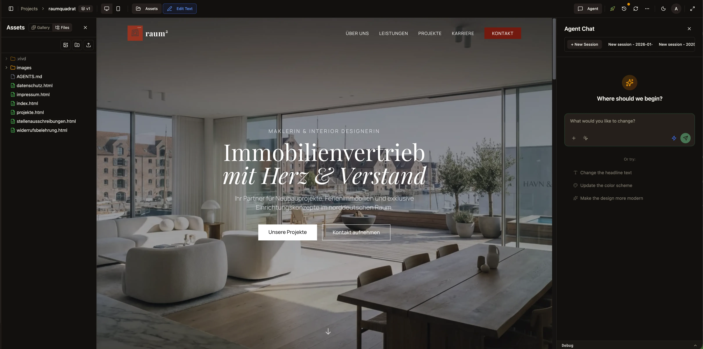
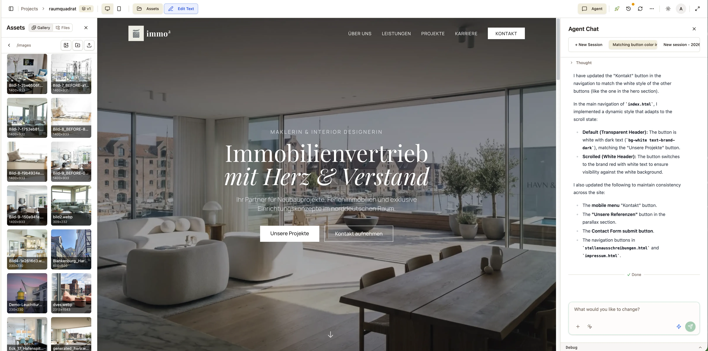

<div align="center">

# vivd

**Build websites by talking to AI**

An AI-powered website builder that turns conversations into live, hosted websites.

[Getting Started](#getting-started) · [Features](#features) · [Tech Stack](#tech-stack) · [Self-Hosting](#self-hosting)

</div>

---



## What is vivd?

vivd is a website builder where AI is the interface. Instead of dragging and dropping or writing code, you simply describe what you want — and it happens. The AI agent analyzes your existing content, understands your brand, and builds pages using modern web technologies.

Perfect for photographers, agencies, freelancers, and small businesses who want professional websites without the learning curve.

## Features

### Chat-Driven Editing

Open the chat panel, describe your changes, and watch them happen in real-time. Select specific elements on the page for targeted edits, or let the AI make sweeping changes across your entire site.

### Asset Management

Drag and drop images, manage your files, and let the AI incorporate them into your designs. The built-in asset explorer keeps everything organized.



### Visual Editor

Click "Edit Text" to make direct changes on the page. Combined with AI assistance, you get the best of both worlds — quick manual tweaks and intelligent automated edits.

### One-Click Publishing

Go from draft to live in seconds. vivd handles hosting, so your site is available on the internet the moment you click publish.

### Multi-Project Workspace

Manage multiple websites from a single dashboard. Switch between projects instantly, each with its own version history.

## Tech Stack

| Layer | Technology |
|-------|------------|
| **Frontend** | React 19, TypeScript, Vite, Tailwind CSS v4, Radix UI |
| **Backend** | Node.js, Express, tRPC, Drizzle ORM |
| **Database** | PostgreSQL |
| **AI** | OpenRouter (Gemini, GPT-4, Claude, and more) |
| **Scraping** | Puppeteer with stealth mode |
| **Auth** | Better Auth |
| **Deployment** | Docker Compose, Caddy |

## Project Structure

```
vivd/
├── packages/
│   ├── backend/     # Express API + AI agent integration
│   ├── frontend/    # React web application
│   ├── scraper/     # Puppeteer web scraping service
│   ├── shared/      # Shared types and utilities
│   └── theme/       # CSS theme package
├── assets/          # Static assets and screenshots
└── docs/            # Architecture and planning docs
```

## Getting Started

### Prerequisites

- Node.js 20+
- Docker & Docker Compose
- PostgreSQL (or use the Docker setup)

### Development Setup

```bash
# Clone the repository
git clone https://github.com/your-org/vivd.git
cd vivd

# Install dependencies
npm install

# Copy environment variables
cp .env.example .env

# Start the database
docker compose up -d db

# Run database migrations
npm run db:migrate

# Start all services in development mode
npm run dev
```

The app will be available at `http://localhost:5173`

## Self-Hosting

vivd can be self-hosted using Docker Compose:

```bash
# Configure your environment
cp .env.example .env
# Edit .env with your settings (database, API keys, etc.)

# Start all services
docker compose up -d
```

Services included:
- **Frontend** — React application
- **Backend** — API server with AI agent
- **Scraper** — Web scraping service
- **Database** — PostgreSQL
- **Caddy** — Reverse proxy with automatic HTTPS

## Configuration

Key environment variables:

| Variable | Description |
|----------|-------------|
| `DATABASE_URL` | PostgreSQL connection string |
| `OPENROUTER_API_KEY` | API key for AI model access |
| `BETTER_AUTH_SECRET` | Secret for authentication |
| `PUBLIC_URL` | Your public-facing URL |

See `.env.example` for the full list.

## GitHub Sync (Optional)

vivd can automatically sync project versions to GitHub:

- On **Save** and **Publish**: pushes to GitHub (creates repo if missing)
- On **Preview open**: pulls/rebases from GitHub

Enable with:
```bash
GITHUB_SYNC_ENABLED=true
GITHUB_ORG=your-org
GITHUB_TOKEN=your-token
```

## License

Creative Commons Attribution-NonCommercial-ShareAlike 4.0 International (CC BY-NC-SA 4.0)

vivd is free for non-commercial use. See [LICENSE](LICENSE) for details.

---

<div align="center">

**[vivd.studio](https://vivd.studio)**

</div>
