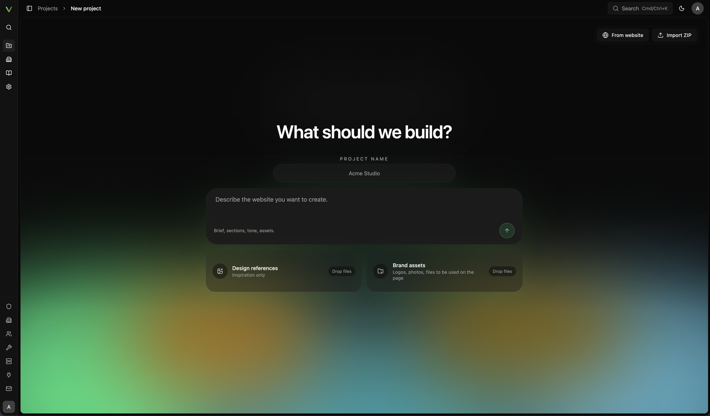

<div align="center">

# vivd

**Build & Host Websites by Talking to AI**

An AI-powered website builder and agentic website workflow that turns a brief, a reference site, or a conversation into a live website. Fair-code and self-hostable, with [OpenCode](https://github.com/anomalyco/opencode) running in isolated project environments and publishing built into the workflow.

[Public Docs](https://docs.vivd.studio) · [Features](https://docs.vivd.studio/features/) · [Development](#development) · [Self-Hosting](#self-hosting)

</div>

---



## What vivd is

vivd is a website builder & hosting platform where AI is the interface. The practical goal is "AI web agency in product form": you create a project, describe what you want, and keep moving from first idea to the live site in one system.

You can start from scratch or import an existing website (by scraping or uploading a ZIP), then keep shaping it in Studio with chat, direct edits, assets, preview, plugins, and publishing flows that all belong to the same project instead of a chain of separate tools.


Under the hood, Vivd runs [OpenCode](https://github.com/anomalyco/opencode) inside isolated Studio environments, and builds on top of [Astro](https://astro.build), so the agent works with real project files and therefore has unlimited potential rather than being trapped in static templates. In Astro-backed projects that means a real Astro workspace with Astro primitives, not a locked black-box builder. That matters because it lets Vivd cover the whole path: generate a draft, refine it in a real workspace, wire plugins into the same project, and solve publishing as part of the same system instead of handing you off to another stack at the end. By adding in the CMS capabilities, the agent can also work with structured content, and the user can edit it over a structured form UI instead of a generic text editor.

Vivd is also meant to be something you can actually run yourself: fair-code, self-hostable, and built so the product works both as a hosted offering and as your own one-host deployment.

## Current Product Shape

- The hosted Vivd product remains invite-led / closed-beta rather than broadly open signup.
- The public self-host path is available today for `solo` deployments: one primary host, Docker-based Studio machines, and local S3-compatible storage by default.
- Astro and plain HTML are the current website project targets, with Astro content collections acting as the structured CMS source of truth where supported.
- First-party plugin extraction is underway; Contact Form and Analytics already ship as extracted plugin packages behind generic host contracts.
- A dedicated artifact-builder runtime exists behind `VIVD_ARTIFACT_BUILDER_ENABLED`, but it remains dark-launched until the end-to-end path is production-verified.

Public product docs live in `packages/docs`. Internal planning and architecture notes live in `plans/`.

## Core Product Features

- start from scratch from a brief, design references, and brand assets
- import an existing website or ZIP into a first draft
- refine the project in Studio with AI chat, direct edits, preview, files, assets, and structured CMS flows
- keep plugins such as Contact Form and Analytics inside the same project flow, with more first-party plugin work in progress
- publish to the live domain and keep self-hosting as a first-class path instead of a sidecar afterthought

## What the agent can actually do

The agent in Vivd is not limited to rewriting copy. It can work across the real project, use built-in platform capabilities, and take a site much closer to done on its own.

- create and restructure pages, components, styles, and content in the workspace
- generate images and add them directly into the site
- add first-party Vivd plugins such as Contact Form and Analytics, and wire plugin-backed features into the real project
- fetch the plugin information it needs from Vivd itself and use platform-side capabilities instead of stopping at generic chat suggestions
- keep working all the way through preview, publishing, and the broader website lifecycle instead of stopping at mockups
- operate on a real Astro project/workspace where supported, so the result is portable and not trapped in Vivd

That is a core part of the product: Vivd ships platform capabilities the agent can actually use, not just a chat box around an LLM. More first-party plugins are planned over time.

## What The Repo Contains

- `packages/frontend` and `packages/backend` power the main app and control plane.
- `packages/studio` is the isolated Studio runtime where editing and agent work happen.
- `packages/cli` is the operator/user CLI surface for connected runtime and platform actions.
- `packages/scraper` is the dedicated website import/scraping service.
- `packages/docs` is the public docs site.
- `packages/shared` holds shared config, contracts, and types used across services.
- `packages/theme` contains shared design tokens and theme styles.
- `packages/builder` is the dedicated artifact-builder runtime that is currently still dark-launched.
- `plugins/` groups plugin-owned workspaces, including `plugins/sdk`, `plugins/installed`, `plugins/native/*`, and `plugins/external/*`.
- `plans/` holds internal notes, planning, and architecture material.

## Development

### Prerequisites

- Node.js 20+
- Docker Engine + Docker Compose v2
- `OPENROUTER_API_KEY`

### Recommended Local Workflow

```bash
git clone https://github.com/felixpahlke/vivd.git
cd vivd
npm install
cp .env.example .env
# set at least OPENROUTER_API_KEY in .env
docker compose watch
```

`docker compose watch` is the normal day-to-day loop for this repo. The default local Compose path now assumes `STUDIO_MACHINE_PROVIDER=docker`, and `docker-compose.override.yml` only watches the main app services for that workflow. If you only want to start the stack without live sync/rebuild, `docker compose up -d` still works.

If you are iterating on the packaged Studio runtime itself, point the backend at a local Studio image in `.env`:

```bash
DOCKER_STUDIO_IMAGE=vivd-studio:local
```

Then use:

```bash
npm run studio:dev:refresh
```

That helper rebuilds `vivd-studio:local` and stops matching managed Docker-provider Studio runtimes so the next open/restart comes back on the rebuilt image.

If you explicitly want the older local-provider child-process loop, start Compose with the extra override:

```bash
docker compose \
  -f docker-compose.yml \
  -f docker-compose.override.yml \
  -f docker-compose.local-provider.yml \
  watch
```

That override flips the backend to `STUDIO_MACHINE_PROVIDER=local`, restores the standalone `studio` service, and adds the old backend rebuild-on-`packages/studio` watch rule.

For the default Compose-based local setup, the backend container runs Drizzle migrations on startup. You usually do not need a separate host-side `npm run db:migrate` just to boot the stack.

For day-to-day local work, the main endpoints are:

- `http://localhost/` for the published-site host and default fallback page
- `http://localhost/vivd-studio` for the control plane and Studio entry
- `http://docs.localhost/` for the public docs workspace
- `http://api.localhost/plugins/*` for the public plugin API host in local dev

`.env.example` is Compose-oriented. If you run packages directly on the host instead of inside Compose, replace service hostnames such as `postgres`, `backend`, and `scraper` with host-reachable values.

### Optional Host-Side Workspace Commands

If you stay inside `docker compose watch`, you can usually ignore these. They are mainly useful for targeted validation, debugging one workspace directly on the host, or working outside Compose.

| Purpose | Command |
| --- | --- |
| Run a single workspace directly on the host | `npm run dev -w @vivd/<backend|frontend|studio|docs|scraper>` |
| Run a targeted typecheck | `npm run typecheck -w @vivd/<backend|frontend|studio|docs|scraper>` |
| Run targeted tests | `npm run test:run -w @vivd/<backend|frontend|studio|scraper>` |
| Rebuild local Studio image and stop Docker-provider runtimes | `npm run studio:dev:refresh` |
| Run backend integration tests | `npm run test:integration -w @vivd/backend -- <path-to-test>` |
| Generate Drizzle migrations | `npm run db:generate` |
| Apply Drizzle migrations | `npm run db:migrate` |
| Local CI-style check | `npm run ci:local` |

Vivd uses npm workspaces with one root `package-lock.json`. Install dependencies at the repo root and prefer workspace-scoped commands such as `npm run typecheck -w @vivd/backend` when you want a targeted check.

For tests, prefer targeted runs in the areas you changed before reaching for the broader `ci:local` variants.

## Self-Hosting

The public self-host install/docs path currently covers `solo` only. The hosted Vivd
product is still invite-led rather than broadly open.

Vivd currently ships a first-party `solo` self-host path:

- one primary public host
- Studio mounted at `/vivd-studio`
- same-host public plugin routes under `/plugins/*`
- Docker-based Studio machines by default
- local S3-compatible project storage by default

The current public install path is:

```bash
curl -fsSL https://docs.vivd.studio/install.sh | bash
```

For operator-facing details, use the public docs for [Self-Hosting](https://docs.vivd.studio/self-hosting/), [How Vivd Works](https://docs.vivd.studio/how-vivd-works/), [Instance Settings](https://docs.vivd.studio/instance-settings/), and [Domains & Publish Targets](https://docs.vivd.studio/domains-and-publish-targets/).

## License

vivd follows a fair-code, source-available licensing model.

The binding legal terms are the Business Source License 1.1 (BUSL-1.1) with a Vivd-specific Additional Use Grant. This is not an OSI-approved open-source license.

- Free without a separate commercial license: self-hosted `solo` deployments and other single-tenant deployments dedicated to one entity under the Additional Use Grant, including contractor/service-provider work on that entity's behalf.
- Separate commercial license required: `platform`, multi-tenant, shared-control-plane, hosted SaaS from a shared deployment/control layer, white-label, OEM, embedded, and other productized commercial uses outside that grant.
- Generated website output created with vivd is not itself the Licensed Work.

See [LICENSE](LICENSE) for the binding terms and [LICENSING.md](LICENSING.md) for the plain-language summary.

---

<div align="center">

**[vivd.studio](https://vivd.studio)**

</div>
