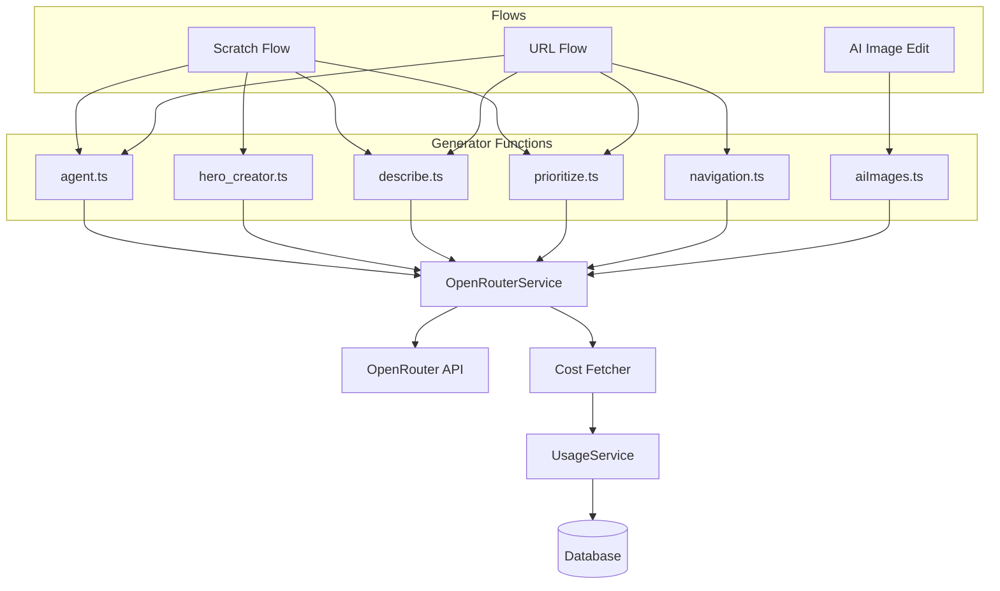

# Centralized OpenRouter Usage Tracking

## Problem Statement

Currently, OpenRouter API calls are scattered across multiple files with no cost tracking:

- **OpenCode** (via opencode/index.ts) already tracks costs via the `step-finish` event
- **OpenRouter direct calls** (image generation, HTML generation, analysis) have NO cost tracking

Your credit system uses `dollars * 100` (1 credit = 1 cent), which aligns with OpenRouter's dollar-based billing.

## Research Findings

### OpenRouter Cost Data

OpenRouter provides cost via `GET /api/v1/generation?id=$GENERATION_ID`:

```json
{
  "data": {
    "id": "gen-xxxxx",
    "total_cost": 0.0015,        // ← Total cost in DOLLARS
    "tokens_prompt": 10,
    "tokens_completion": 25,
    ...
  }
}
```

> [!IMPORTANT]
> The response `id` from a chat completion (e.g., `"id": "gen-xxxxx"`) can be used to fetch cost via `/api/v1/generation?id=$ID`. However, cost data **may not be immediately available** after the request completes - we need to handle this with retries.

---

## Complete OpenRouter Call Site Audit

### Files Using OpenAI SDK (via `client.ts`)

| File                                                 | Function                      | Purpose                           |
| ---------------------------------------------------- | ----------------------------- | --------------------------------- |
| `backend/src/generator/agent.ts`                     | `generate()`                  | HTML generation for pages         |
| `backend/src/generator/hero_creator.ts`              | `generateHeroPrompt()`        | Generate prompt for hero image    |
| `backend/src/generator/image_analyzer/describe.ts`   | `describeImage()`             | Image description/analysis        |
| `backend/src/generator/image_analyzer/prioritize.ts` | `prioritizeImages()`          | Image prioritization              |
| `backend/src/generator/scraper/navigation.ts`        | `extractNavigationLinks()`    | Extract nav links from screenshot |
| `backend/src/generator/scraper/navigation.ts`        | `prioritizeNavigationLinks()` | Prioritize which links to scrape  |

### Files Using Direct Axios Calls

| File                                     | Function                | Purpose               |
| ---------------------------------------- | ----------------------- | --------------------- |
| `backend/src/generator/hero_creator.ts`  | `generateImage()`       | Hero image generation |
| `backend/src/routers/assets/aiImages.ts` | `editImageWithAI`       | AI image editing      |
| `backend/src/routers/assets/aiImages.ts` | `createImageWithAI`     | AI image creation     |
| `backend/src/routers/assets/aiImages.ts` | `removeImageBackground` | Background removal    |

**Total: 10 OpenRouter calls across 6 files**

---

## Proposed Changes

### Architecture Overview



---

### Component: OpenRouterService

#### [NEW] `backend/src/services/OpenRouterService.ts`

```typescript
interface FlowContext {
  flowId: string; // e.g., 'scratch', 'url', 'image_edit', 'image_create', 'bg_remove'
  projectSlug?: string;
}

interface OpenRouterResponse<T> {
  data: T;
  generationId: string; // The 'id' field from the response
}

class OpenRouterService {
  // Main method for chat completions (text, vision, reasoning)
  async createChatCompletion(
    options: ChatCompletionOptions,
    flowContext?: FlowContext,
  ): Promise<OpenRouterResponse<ChatCompletion>>;

  // For multimodal image generation (Gemini, GPT-5, etc.)
  async createImageGeneration(
    options: ImageGenerationOptions,
    flowContext?: FlowContext,
  ): Promise<OpenRouterResponse<ImageGeneration>>;

  // Fetch cost with retry for delayed availability
  private async fetchCostWithRetry(
    generationId: string,
    maxRetries: number = 3,
    delayMs: number = 500,
  ): Promise<number | null>;
}
```

**Key Features:**

1. Unified interface for all OpenRouter calls
2. `FlowContext` for attribution (1 aggregated entry per flow)
3. Automatic cost fetching with retry for delayed availability
4. Cost recording via UsageService

---

### Handling Delayed Cost Data

> [!WARNING]
> OpenRouter's `/api/v1/generation` endpoint may not have cost data immediately after a request completes.

**Strategy: Async cost fetching with retry**

```typescript
private async fetchCostWithRetry(
  generationId: string,
  maxRetries = 3,
  delayMs = 500
): Promise<number | null> {
  for (let attempt = 0; attempt < maxRetries; attempt++) {
    if (attempt > 0) {
      await sleep(delayMs * attempt);  // Exponential backoff
    }

    try {
      const response = await axios.get(
        `https://openrouter.ai/api/v1/generation?id=${generationId}`,
        { headers: { Authorization: `Bearer ${OPENROUTER_API_KEY}` } }
      );

      const cost = response.data?.data?.total_cost;
      if (cost !== undefined && cost !== null) {
        return cost;
      }
    } catch (error) {
      console.warn(`[OpenRouter] Cost fetch attempt ${attempt + 1} failed:`, error.message);
    }
  }

  console.warn(`[OpenRouter] Could not fetch cost for ${generationId} after ${maxRetries} attempts`);
  return null;  // Return null, don't block the main flow
}
```

**Implementation approach:**

- Cost fetching happens **after** the main API call completes
- Uses exponential backoff: 0ms, 500ms, 1000ms
- If cost cannot be fetched, log a warning but don't fail the operation
- Record cost as 0 if unavailable (can be reconciled later via OpenRouter dashboard)

---

### Component: UsageService Updates

#### [MODIFY] `backend/src/services/UsageService.ts`

```typescript
// New simplified method for OpenRouter costs
async recordOpenRouterCost(
  cost: number,                    // Cost in dollars
  generationId: string,            // For idempotency
  flowId: string,                  // 'scratch' | 'url' | 'image_edit' | 'image_create' | 'bg_remove' | 'hero_gen'
  projectSlug?: string
): Promise<void>;
```

**Changes:**

- `eventType` column will include the flow ID for grouping
- Admin dashboard will show 1 aggregated row per flow execution
- Cost is always in dollars (matching your 1 credit = 1 cent system)

---

### Flow Context Threading

To aggregate costs per action, we need to thread flow context through the generation:

#### Scratch Flow Example

```typescript
// scratchFlow.ts
export async function runScratchFlow(
  ctx: GenerationContext,
  input: ScratchFlowInput,
) {
  const flowContext = { flowId: "scratch", projectSlug: ctx.slug };

  // These will all be aggregated under one 'scratch' flow entry
  await analyzeImages(ctx.outputDir, flowContext);
  await generateHtml({ ...options, flowContext });
}
```

#### URL Flow Example

```typescript
// urlFlow.ts
export async function runUrlFlow(ctx: GenerationContext, input: UrlFlowInput) {
  const flowContext = { flowId: "url", projectSlug: ctx.slug };

  // Navigation, analysis, HTML gen all aggregated under 'url'
  await scrapeAndProcess(url, flowContext);
  await generateHtml({ ...options, flowContext });
}
```

---

## Migration Path

### Phase 1: Create OpenRouterService

1. Create `src/services/OpenRouterService.ts`
2. Implement cost fetching with retry
3. Add `recordOpenRouterCost()` to UsageService

### Phase 2: Migrate Generator Functions

1. Update `client.ts` → integrate with OpenRouterService
2. Update each file to pass `FlowContext`:
   - `agent.ts`
   - `hero_creator.ts`
   - `describe.ts`
   - `prioritize.ts`
   - `navigation.ts`

### Phase 3: Migrate Image Procedures

1. Update `aiImages.ts` to use OpenRouterService
2. Replace `recordImageGeneration()` calls with `recordOpenRouterCost()`

### Phase 4: Clean Up

1. Remove redundant code
2. Update admin dashboard to show flow-based aggregation

---

## Database Changes

No schema changes required. Using existing fields:

- `eventType`: Will store flow ID (e.g., 'scratch', 'url', 'image_edit')
- `cost`: Already stores dollar amounts
- `idempotencyKey`: Will use `generationId` from OpenRouter

---

## Verification Plan

### Automated Tests

1. Unit test `OpenRouterService.fetchCostWithRetry()` with mocked responses
2. Test retry behavior when cost is initially unavailable
3. Verify idempotency (same generationId not recorded twice)

### Manual Verification

1. Generate a scratch flow page → verify single aggregated cost entry
2. Generate a URL flow page → verify single aggregated cost entry
3. Edit an image with AI → verify image_edit cost entry
4. Check admin dashboard shows correct flow-based grouping

---

## Summary

| Before                        | After                                    |
| ----------------------------- | ---------------------------------------- |
| 10 scattered OpenRouter calls | 1 centralized OpenRouterService          |
| No cost tracking              | Dollar-based cost tracking               |
| Image counting only           | Actual dollar costs                      |
| No flow attribution           | Costs grouped by flow (scratch/url/edit) |
| Blocking cost fetch           | Async fetch with retry                   |
