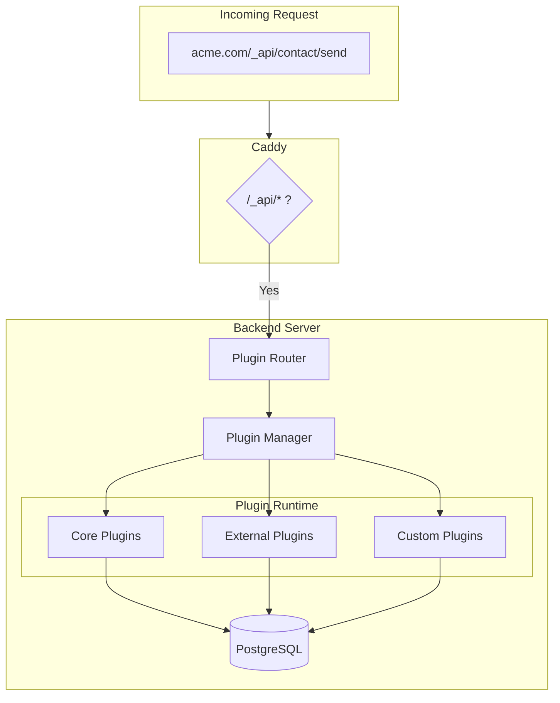

# Vivd Plugin System Architecture

A flexible, extensible plugin system that enables server-side functionality for static pages, with support for pre-built plugins, community plugins via Git, and agent-created custom plugins.

---

## Core Design Principles

1. **File-first configuration** – Plugins are enabled/configured via files the agent can edit
2. **Git-based distribution** – Plugins are Git repos, versioned via tags
3. **Sandboxed execution** – Agent-written plugins run in isolation
4. **Standardized interfaces** – Clear contracts for plugin authors
5. **Single-tenant simplicity** – One DB per instance, plugins share tables with site isolation
6. **Framework-agnostic** – Works with static HTML, React, Astro, Next.js, etc.

---

## Architecture Overview



---

## Plugin Types

| Type         | Author            | Location                   | Loaded From                 | Example               |
| ------------ | ----------------- | -------------------------- | --------------------------- | --------------------- |
| **Core**     | Vivd team         | `plugins/` in monorepo     | Bundled in Docker image     | Contact form, Booking |
| **External** | Vivd or Community | Git repos                  | Cloned at runtime to volume | Reviews, Analytics    |
| **Custom**   | Agent             | `projects/<slug>/plugins/` | Project directory           | Site-specific logic   |

---

## Repository Structure

```
vivd/                           # Main monorepo
├── frontend/
├── backend/
├── scraper/
├── plugins/                    # Core plugins (first-class citizens)
│   ├── contact-form/
│   │   ├── manifest.json
│   │   ├── server/
│   │   │   ├── index.ts
│   │   │   ├── handlers.ts
│   │   │   └── schema.ts
│   │   ├── client/
│   │   │   ├── ContactForm.tsx
│   │   │   └── widget.js
│   │   └── README.md
│   ├── booking/
│   │   ├── manifest.json
│   │   ├── server/
│   │   ├── client/
│   │   └── pages/              # Admin pages
│   │       └── BookingsAdmin.tsx
│   ├── newsletter/
│   └── _template/              # Starter template for new plugins
├── docs/
└── docker-compose.yml

# External plugins (separate repos in vivd-studio org)
github.com/vivd-studio/plugin-reviews
github.com/vivd-studio/plugin-analytics
github.com/vivd-studio/plugin-events-calendar

# Community plugins (any org, follows spec)
github.com/someone/vivd-plugin-testimonials
```

---

## Plugin Manifest

```json
{
  "name": "contact-form",
  "version": "1.0.0",
  "description": "Simple contact form with email notifications",
  "author": "Vivd",

  "routes": [
    {
      "method": "POST",
      "path": "/send",
      "handler": "server/handlers.ts:sendMessage",
      "rateLimit": { "requests": 10, "window": "1m" }
    }
  ],

  "pages": [
    {
      "path": "/admin/contact-submissions",
      "title": "Contact Submissions",
      "component": "pages/SubmissionsAdmin.tsx",
      "access": "admin",
      "nav": {
        "label": "Messages",
        "icon": "mail",
        "section": "admin"
      }
    }
  ],

  "widgets": [
    {
      "name": "contact-form",
      "script": "client/widget.js",
      "styles": "client/widget.css"
    }
  ],

  "configSchema": "server/schema.ts"
}
```

---

## Plugin Configuration (Per-Project)

```yaml
# projects/<slug>/v<N>/vivd.plugins.yaml

plugins:
  # Core plugin (bundled, no source needed)
  contact-form:
    enabled: true
    config:
      recipient: "hello@acme.com"
      subject_prefix: "[Website]"
      fields:
        - name: "name"
          type: "text"
          required: true
        - name: "email"
          type: "email"
          required: true
        - name: "message"
          type: "textarea"
          required: true
      success_message: "Thanks! We'll be in touch."

  # Core plugin with pages
  booking:
    enabled: true
    config:
      business_name: "Acme Hotel"
      notification_email: "bookings@acme.com"
      time_slots: ["09:00", "10:00", "11:00", "14:00", "15:00"]
      max_guests: 4

  # External plugin (git-based)
  reviews:
    source: "github.com/vivd-studio/plugin-reviews"
    version: "v1.2.0"
    enabled: true
    config:
      moderation: true
      allow_anonymous: false

  # Community plugin
  testimonials:
    source: "github.com/someone/vivd-plugin-testimonials"
    version: "v2.0.0"
    enabled: true

  # Custom plugins (agent-written)
  custom:
    - path: "./plugins/price-calculator"
      enabled: true
```

---

## TypeScript Interfaces

```typescript
// backend/src/plugins/runtime/types.ts

export interface PluginManifest {
  name: string;
  version: string;
  description: string;
  author?: string;

  routes?: RouteDefinition[];
  pages?: PageDefinition[];
  widgets?: WidgetDefinition[];

  configSchema?: string; // Path to Zod schema
  permissions?: Permission[];
}

export interface RouteDefinition {
  method: "GET" | "POST" | "PUT" | "DELETE";
  path: string;
  handler: string; // "file.ts:functionName"
  rateLimit?: { requests: number; window: string };
}

export interface PageDefinition {
  path: string;
  title: string;
  component: string;
  access: "admin" | "public" | "authenticated";
  nav?: {
    label: string;
    icon?: string;
    section?: "admin" | "main";
  };
}

export interface WidgetDefinition {
  name: string;
  script: string;
  styles?: string;
}

export interface PluginContext {
  siteSlug: string;
  siteDomain: string;
  pluginConfig: Record<string, any>;

  db: PluginDatabase;
  http: SandboxedHttp;
  email: EmailService;
  log: PluginLogger;
}

export interface PluginDatabase {
  get(key: string): Promise<any>;
  set(key: string, value: any): Promise<void>;
  delete(key: string): Promise<void>;
  list(prefix?: string): Promise<{ key: string; value: any }[]>;

  // For structured data (core plugins only)
  query?<T>(sql: string, params?: any[]): Promise<T[]>;
}
```

---

## Git-Based Plugin Distribution

### How it works

1. **Core plugins**: Bundled in Docker image from `plugins/` folder
2. **External plugins**: Git-cloned to a volume at startup
3. **Custom plugins**: Read from project directory

### Docker configuration

```dockerfile
# backend/Dockerfile
COPY plugins/ /app/plugins/core/
```

```yaml
# docker-compose.yml
services:
  backend:
    volumes:
      - plugin_cache:/app/plugins/external # Persisted plugin cache
      - backend_data:/app/projects # Contains custom plugins
```

### Plugin Manager startup

```typescript
// backend/src/plugins/runtime/PluginManager.ts

async function initPlugins() {
  // 1. Load core plugins (bundled)
  await loadPluginsFromDir("/app/plugins/core");

  // 2. Load/install external plugins
  const siteConfigs = await getAllSitePluginConfigs();

  for (const config of siteConfigs) {
    for (const [name, plugin] of Object.entries(config.plugins)) {
      if (plugin.source) {
        await ensurePluginInstalled(name, plugin.source, plugin.version);
      }
    }
  }

  await loadPluginsFromDir("/app/plugins/external");
}

async function ensurePluginInstalled(
  name: string,
  source: string,
  version: string
) {
  const pluginPath = `/app/plugins/external/${name}`;

  if (!(await exists(pluginPath))) {
    // Clone the repository
    await exec(
      `git clone --depth 1 --branch ${version} https://${source}.git ${pluginPath}`
    );
  } else {
    // Check if version matches, update if needed
    const currentVersion = await exec(`git -C ${pluginPath} describe --tags`);
    if (currentVersion !== version) {
      await exec(`git -C ${pluginPath} fetch --tags`);
      await exec(`git -C ${pluginPath} checkout ${version}`);
    }
  }
}
```

---

## Caddy Routing Integration

When a site is published with plugins enabled:

```caddyfile
# Generated in sites.d/<domain>.caddy
acme.com {
    # Plugin API routes
    handle /_api/* {
        reverse_proxy backend:3000
    }

    # Plugin widget/page assets
    handle /_plugins/* {
        reverse_proxy backend:3000
    }

    # Static files
    handle {
        root * /srv/published/acme
        try_files {path} {path}/index.html =404
        file_server
    }
}
```

Backend routes:

- `/_api/<plugin-name>/<action>` → Plugin handler
- `/_plugins/<plugin-name>/widget.js` → Client widget bundle
- `/_plugins/<plugin-name>/pages/*` → Plugin pages

---

## Agent Integration

### Enabling a plugin

Agent edits `vivd.plugins.yaml`:

```yaml
plugins:
  contact-form:
    enabled: true
    config:
      recipient: "hello@acme.com"
```

### Adding widget to page

Agent adds to `index.html`:

```html
<div data-vivd-plugin="contact-form"></div>
<script src="/_plugins/contact-form/widget.js"></script>
```

### Creating custom plugin

Agent creates files in project's `plugins/` directory:

```
projects/<slug>/v<N>/
└── plugins/
    └── availability-checker/
        ├── manifest.json
        └── handler.ts
```

```json
// manifest.json
{
  "name": "availability-checker",
  "version": "1.0.0",
  "routes": [
    {
      "method": "GET",
      "path": "/check",
      "handler": "handler.ts:checkAvailability"
    }
  ]
}
```

```typescript
// handler.ts
export async function checkAvailability(ctx: PluginContext, req: Request) {
  const date = new URL(req.url).searchParams.get("date");
  const result = await ctx.http.get(`https://api.hotel.com/avail?date=${date}`);
  return Response.json({ available: result.rooms > 0 });
}
```

---

## Core Plugins (Initial Set)

| Plugin           | Description                     | Pages                      |
| ---------------- | ------------------------------- | -------------------------- |
| **contact-form** | Email on form submission        | Admin: Submissions list    |
| **booking**      | Date/time slot booking          | Admin: Bookings management |
| **newsletter**   | Email signup with double opt-in | Admin: Subscriber list     |

### Future plugins (separate repos)

| Plugin          | Description                              | Complexity |
| --------------- | ---------------------------------------- | ---------- |
| reviews         | Submit & display reviews with moderation | Medium     |
| faq             | Dynamic FAQ with admin editing           | Low        |
| events-calendar | Event listings with calendar view        | Medium     |
| gallery         | Image gallery with lightbox              | Low        |
| comments        | Blog comments system                     | Medium     |

---

## Database Schema

```sql
-- Generic plugin state (key-value)
CREATE TABLE plugin_state (
  id UUID PRIMARY KEY DEFAULT gen_random_uuid(),
  site_slug TEXT NOT NULL,
  plugin_name TEXT NOT NULL,
  key TEXT NOT NULL,
  value JSONB NOT NULL,
  created_at TIMESTAMP DEFAULT NOW(),
  updated_at TIMESTAMP DEFAULT NOW(),
  UNIQUE(site_slug, plugin_name, key)
);

-- Contact submissions
CREATE TABLE contact_submissions (
  id UUID PRIMARY KEY DEFAULT gen_random_uuid(),
  site_slug TEXT NOT NULL,
  data JSONB NOT NULL,
  read BOOLEAN DEFAULT false,
  created_at TIMESTAMP DEFAULT NOW()
);

-- Bookings
CREATE TABLE bookings (
  id UUID PRIMARY KEY DEFAULT gen_random_uuid(),
  site_slug TEXT NOT NULL,
  guest_name TEXT NOT NULL,
  guest_email TEXT NOT NULL,
  guest_phone TEXT,
  date DATE NOT NULL,
  time_slot TEXT NOT NULL,
  guests INTEGER DEFAULT 1,
  notes TEXT,
  status TEXT DEFAULT 'pending',
  created_at TIMESTAMP DEFAULT NOW()
);

-- Newsletter subscribers
CREATE TABLE newsletter_subscribers (
  id UUID PRIMARY KEY DEFAULT gen_random_uuid(),
  site_slug TEXT NOT NULL,
  email TEXT NOT NULL,
  confirmed BOOLEAN DEFAULT false,
  confirm_token TEXT,
  created_at TIMESTAMP DEFAULT NOW(),
  UNIQUE(site_slug, email)
);
```

---

## Security

1. **Sandbox for custom plugins**: V8 isolates for agent-written code
2. **Network allowlist**: Custom plugins can only call whitelisted domains
3. **Rate limiting**: Per-plugin, per-site rate limits (defined in manifest)
4. **Input validation**: All plugin inputs validated via Zod schemas
5. **No filesystem access**: Custom plugins have no direct FS access
6. **Git source verification**: Only allow trusted sources or require approval

---

## Implementation Phases

### Phase 1: Core Runtime

- [ ] Create `plugins/` folder structure
- [ ] Plugin manifest schema and validation
- [ ] PluginManager for loading/registering
- [ ] PluginRouter for request routing
- [ ] Database schema for plugin state

### Phase 2: Contact Form Plugin

- [ ] Implement contact-form in `plugins/contact-form/`
- [ ] Email sending integration (Resend)
- [ ] Client widget
- [ ] Admin page for submissions

### Phase 3: Booking Plugin

- [ ] Implement booking in `plugins/booking/`
- [ ] Admin page for managing bookings
- [ ] Email confirmations
- [ ] Calendar widget

### Phase 4: External Plugin Support

- [ ] Git-based plugin installation
- [ ] Plugin version management
- [ ] Plugin update mechanism

### Phase 5: Custom Plugin Support

- [ ] Sandbox execution environment
- [ ] Agent can create plugins in project directory
- [ ] PLUGINS.md auto-generation

### Phase 6: Plugin Development DX

- [ ] `_template/` plugin starter
- [ ] Plugin development docs
- [ ] Hot-reload for plugin development
