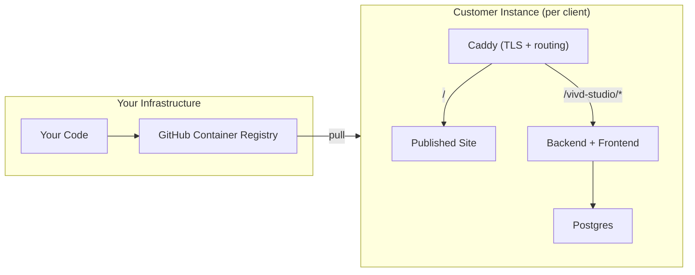
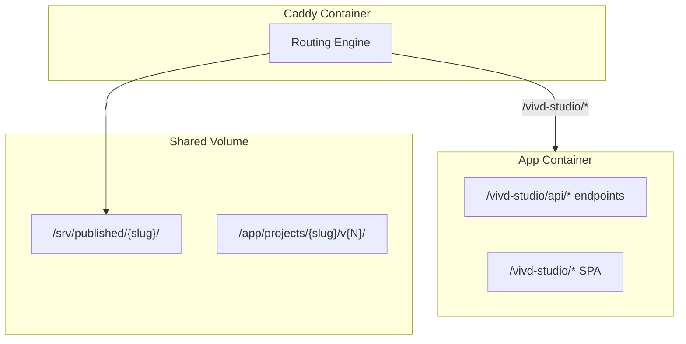

# Vivd: Product Roadmap

> Single-tenant, managed-first AI website builder

---

## Architecture Overview



**Key decisions**:

- ✅ Single-tenant (one instance per customer, one published site)
- ✅ Backend serves frontend (2 containers: App + Caddy)
- ✅ GHCR for private image distribution
- ✅ Path-based admin (`acme.com/vivd-studio`)
- ✅ Project limit controlled by `LICENSE_MAX_PROJECTS` (default: 1)

---

## Phase 1: Core Product Polish ✅ (Completed)

### 1.1 Project Creation Flow ✅

- [x] Create `ProjectWizard` component with step flow
- [x] **URL flow**: Legal disclaimer checkbox + existing generation pipeline
- [ ] **Scratch flow** (coming soon placeholder added)

### 1.2 Chat UX Improvements ✅

- [x] Element selector mode with XPath
- [x] Empty state prompt
- [x] Clear visual feedback for success/error states
- [x] `postMessage` bridge for iframe → parent element selection

---

## Phase 2: Save, Publish & Caddy Integration (Current Focus)

> Git-based versioning with publish-to-production flow

### 2.1 Git-Based Save System

**Concepts**:

- **Working copy**: Current edits (auto-saved to files, uncommitted)
- **Save**: Git commit with message (creates a version)
- **Load**: Checkout a specific commit/version

**Terminology**:

- **Working** → Current uncommitted changes you're editing (live preview)
- **Saved** → A git commit (versioned snapshot)
- **Published** → The version deployed to production (Caddy)

**User flow**:

```
┌─────────────────────────────────────────────┐
│ Project: acme-corp                  [Save ▼]│
│                                             │
│ ⚡ Working (unsaved changes)                │
│                                             │
│ Version History                             │
│ ├── "Updated hero text"   10:30  📦 Published│
│ ├── "New contact section" 09:15             │
│ └── "Initial version"     08:00             │
│                                             │
│        [Load Version]  [Publish Latest]     │
└─────────────────────────────────────────────┘
```

**Tasks**:

#### Backend: Git Operations ✅

- [x] **Create `GitService` module** (`backend/src/services/GitService.ts`)

  - [x] `save({ slug, message })` → `git add . && git commit -m "message"`
  - [x] `getHistory({ slug })` → `git log --oneline --format=json`
  - [x] `loadVersion({ slug, commitHash })` → `git checkout <hash> -- .`
  - [x] `getCurrentCommit({ slug })` → `git rev-parse HEAD`
  - [x] `hasUncommittedChanges({ slug })` → `git status --porcelain`

- [x] **Project Router Endpoints** (`backend/src/routers/project.ts`)
  - [x] `project.save` → commit with message
  - [x] `project.history` → list versions (commits)
  - [x] `project.loadVersion` → checkout specific version
  - [x] `project.hasChanges` → check for uncommitted changes

#### Frontend: Version UI ✅

- [x] **VersionHistoryPanel** component (consolidated with save in one button)

  - [x] Show "Working" state at top if uncommitted changes exist
  - [x] List of commits with hash, message, date
  - [ ] "📦 Published" tag on the deployed version _(pending publish workflow)_
  - [x] "Load" button per version
  - [x] "Current" indicator for checked-out version
  - [x] "Discard changes" option

- [x] **SaveVersionDialog** component

  - [x] Text input for commit message (with suggested default)
  - [x] Save button
  - [x] No-changes detection (prevents empty commits)

- [x] **Toolbar integration** (consolidated save + history in one button)
  - [x] Save/History dropdown button in preview toolbar
  - [x] Version history panel toggle
  - [x] Uncommitted changes indicator

---

### 2.2 Caddy Integration

> Add Caddy as reverse proxy and static file server

**Architecture**:



**Tasks**:

#### Docker Configuration ✅

- [x] **Add Caddy service** to `docker-compose.yml`

  ```yaml
  caddy:
    image: caddy:2-alpine
    ports:
      - "80:80"
      - "443:443"
    volumes:
      - ./Caddyfile:/etc/caddy/Caddyfile
      - caddy_data:/data
      - published_sites:/srv/published
    depends_on:
      - backend
  ```

- [x] **Create Caddyfile** (`/Caddyfile`)

  ```caddyfile
  {$DOMAIN:localhost} {
      # Admin panel + API (all under /vivd-studio/*)
      handle /vivd-studio/* {
          reverse_proxy backend:3000
      }

      # Published site (static files)
      handle {
          root * /srv/published
          try_files {path} {path}/ /index.html
          file_server
      }
  }
  ```

- [x] **Add shared volumes**
  - `published_sites:/srv/published` (Caddy reads)
  - Mount same volume to backend for publishing

---

### 2.3 Publish Workflow ✅

> Deploy specific version to production (Caddy-served root)

**Tasks**:

- [x] **Backend: Publish Service**

  - [x] `publish({ slug, commitHash? })` → copy version files to `/srv/published/{slug}/`
  - [x] Store published commit hash in database (`published_site` table)
  - [x] Domain normalization (strips www., validates format)

- [x] **Frontend: Publish UI**

  - [x] "Publish" button (publishes current/selected version)
  - [x] Published version indicator in history (📦 Published badge)
  - [x] Domain input dialog with real-time validation
  - [x] "View Live Site" link to domain

- [x] **Database: Published Site Tracking**
  - [x] `published_site` table with domain, commit_hash, published_at
  - [x] Unique constraint on domain
  - [x] Foreign key to user for tracking who published

---

## Phase 3: Scratch Project Flow & Licensing

### 3.1 Scratch Project Flow

> Generate site from business description (no source URL)

**Goal**: Add a second generation pipeline (“scratch”) next to the existing URL scrape pipeline (“url”), with clean boundaries and shared core primitives so both can evolve independently.

**Non-goals (v1)**:

- No full template gallery yet (just a small set of style presets).
- No “reference URL screenshot ingestion” yet (accept the input, but optionally ignore it until v2).
- No multi-page generation yet (still a single `index.html`).

---

#### 3.1.1 Backend: Flow-based generator architecture (primary step)

**Design principles**:

- **Separate orchestration from steps**: a “flow” calls steps in order; steps are reusable building blocks.
- **Single project artifact shape**: both flows produce the same on-disk structure under `projects/<slug>/v<N>/` so preview/editor stays identical.
- **Backwards compatible**: keep `processUrl()` working and tolerant of old manifests.

**Target structure** (initial):

```
backend/src/generator/
  flows/
    urlFlow.ts
    scratchFlow.ts
    types.ts
  core/
    context.ts           # create/load output dirs + status writer
    html.ts              # html extraction + write helpers
    prompts/
      url.ts
      scratch.ts
  steps/
    scrape.ts            # wraps existing scraper (url-only)
    analyzeImages.ts
    createHero.ts
    generateHtml.ts      # agent wrapper (works with/without screenshot)
```

**Tasks**:

- [ ] Introduce a `GenerationSource = 'url' | 'scratch'` and shared flow/step types (`backend/src/generator/flows/types.ts`)
- [ ] Add a `createGenerationContext(...)` helper (`backend/src/generator/core/context.ts`) that:
  - [ ] Computes slug + version outputDir
  - [ ] Creates/updates `projects/<slug>/manifest.json` and `projects/<slug>/v<N>/project.json`
  - [ ] Exposes `updateStatus(status)` to flows (single writer updates both manifest + project.json)
  - [ ] Stores minimal metadata (`source`, `title` for scratch; `url` for url flow)
- [ ] Refactor current URL pipeline to a dedicated `runUrlFlow(ctx, input)` without changing step behavior:
  - [ ] `scrapeWebsite` → `analyzeImages` → `createHeroImage` → `generateLandingPage` → git init
  - [ ] Keep `processUrl()` exported for compatibility, but delegate internally to `runUrlFlow`
- [ ] Implement `runScratchFlow(ctx, input)`:
  - [ ] Create `website_text.txt` derived from the brief (so downstream prompt building stays consistent)
  - [ ] If the user provided assets, place them in `vN/images/` (same convention as URL flow) so `analyzeImages`/`createHeroImage` can be reused later
  - [ ] Generate `index.html` from a scratch-specific prompt (no screenshot required)
  - [ ] Initialize git repo for the version (same as URL flow)
- [ ] Update agent interface to avoid optional-method branching:
  - [ ] Prefer a single `generate({ prompt, outputDir, screenshotPath?: string })` API instead of `generateWithoutScreenshot?`
- [ ] Make manifest reading tolerant of scratch projects:
  - [ ] `manifest.url` may be empty/undefined for scratch; callers must not assume it exists

**Acceptance criteria**:

- URL flow still generates exactly as before (same statuses, same file outputs).
- Scratch flow produces `projects/<slug>/v1/index.html` plus version metadata and reaches `completed`.
- `project.status` returns a stable preview URL for scratch (`/projects/<slug>/v<N>/index.html`) once completed.

---

#### 3.1.2 Backend API (tRPC): expose scratch generation

**Option A (recommended long-term)**: unify under a single mutation with a discriminated union input:

- `project.generate({ source: 'url', url, createNewVersion? })`
- `project.generate({ source: 'scratch', title, description, ... })`

**Option B (fastest)**: add `project.generateFromScratch` alongside existing `project.generate` and unify later.

**Tasks**:

- [ ] Add mutation for scratch generation (A or B) with minimal inputs:
  - [ ] `title` (or `businessName`)
  - [ ] `businessType` (optional in v1 if you want fewer fields)
  - [ ] `description`
- [ ] Implement slug collision handling (`acme`, `acme-2`, …) and “project exists” semantics (match URL behavior)
- [ ] Ensure `project.list` surfaces a reasonable label for scratch projects (e.g. `title`) instead of only `url`

---

#### 3.1.3 Frontend v1: simple scratch wizard to test backend end-to-end (secondary step)

**V1 scope**: keep it simple and shippable; focus on proving the backend flow.

**Tasks**:

- [ ] Add a new fullscreen route for scratch creation (recommended): `/vivd-studio/projects/new/scratch`
  - [ ] Two-column layout: left = preview/style presets (static), right = guided form
  - [ ] Use `react-hook-form` + `zod`
- [ ] Update `ProjectWizard` “Start from scratch” choice to navigate to the new route
- [ ] Call the new tRPC mutation and poll `project.status` until `completed`, then route into the editor/preview

---

#### 3.1.4 Frontend v2+: richer wizard & inputs (planned)

**Wizard steps (target)**:

- [ ] Step 1: Business basics (name, industry/type, description, goal/CTA)
- [ ] Step 2: Brand direction (tone, style preset, suggested palettes)
- [ ] Step 3: Assets (logo/images) + optional “design references”
- [ ] Step 4: Generate + review initial preview + iterate

**Enhancements**:

- [ ] Asset drop/upload into scratch project (logo/images) and feed into image analysis + hero generation
- [ ] Reference URLs: accept URLs → backend captures screenshots via puppeteer → feed as visual references to the generator
- [ ] Style presets: small curated list, later expandable into a gallery

---

#### 3.1.5 Manual verification (dev)

- [ ] URL flow still works via “New Project → existing website”
- [ ] Scratch flow works via “New Project → scratch” and produces `index.html` + status progression
- [ ] Confirm `manifest.json` + `project.json` written correctly for scratch and URL
- [ ] Confirm preview URL resolves after completion

> Note: Avoid running expensive end-to-end tests frequently; generator uses paid model calls.

---

### 3.2 Feature Licensing System

> Control what each instance can do (env-first, license-server later)

**Restricted features**:

| Feature                | Env Var | Default                              |
| ---------------------- | ------- | ------------------------------------ |
| `LICENSE_IMAGE_GEN`    | `true`  | Image generation enabled             |
| `LICENSE_MAX_PROJECTS` | `1`     | Sites per instance (1 for customers) |
| `LICENSE_MAX_USERS`    | `3`     | Team members                         |

**AI rate limits**:

| Env Var                        | Default    | Purpose           |
| ------------------------------ | ---------- | ----------------- |
| `LICENSE_AI_TOKENS_PER_MINUTE` | `500000`   | Burst protection  |
| `LICENSE_AI_TOKENS_PER_MONTH`  | `10000000` | Monthly cap       |
| `LICENSE_AI_REQUESTS_PER_DAY`  | `200`      | Request throttle  |
| `LICENSE_IMAGE_GEN_PER_DAY`    | `20`       | Daily image limit |
| `LICENSE_IMAGE_GEN_PER_MONTH`  | `50`       | Monthly image cap |

**Tasks**:

- [ ] Create `LicenseService` in backend
  - [ ] Read limits from env vars
  - [ ] Check limits before operations
  - [ ] Return 402/upgrade-required when exceeded
- [ ] **Token tracking**:
  - [ ] Hook into OpenCode task events
  - [ ] Store cumulative usage per month in DB
- [ ] **Image generation tracking**:
  - [ ] Wrap image gen calls with counter
- [ ] Frontend: show usage stats in admin dashboard
- [ ] Frontend: graceful "limit reached" messaging

**Future**: Add license server verification for non-managed customers

---

## Phase 4: Distribution Infrastructure

### 4.1 Container Registry Setup

> Push images to GHCR for customer distribution

**Images** (public on `ghcr.io/vivd-studio/`):

- `vivd-server` - Backend (Node.js + OpenCode)
- `vivd-ui` - Frontend (Nginx serving SPA)
- `vivd-caddy` - Caddy with Caddyfile baked in

**GitHub Actions workflow** (`.github/workflows/publish.yml`):

```yaml
name: Build and Push
on:
  push:
    tags: ["v*"]

jobs:
  build:
    runs-on: ubuntu-latest
    steps:
      - uses: actions/checkout@v4

      - name: Login to GHCR
        uses: docker/login-action@v3
        with:
          registry: ghcr.io
          username: ${{ github.actor }}
          password: ${{ secrets.GITHUB_TOKEN }}

      - name: Build and push vivd-server
        uses: docker/build-push-action@v5
        with:
          context: ./backend
          push: true
          tags: |
            ghcr.io/vivd-studio/vivd-server:${{ github.ref_name }}
            ghcr.io/vivd-studio/vivd-server:latest

      - name: Build and push vivd-ui
        uses: docker/build-push-action@v5
        with:
          context: .
          file: ./frontend/Dockerfile
          target: prod
          push: true
          tags: |
            ghcr.io/vivd-studio/vivd-ui:${{ github.ref_name }}
            ghcr.io/vivd-studio/vivd-ui:latest

      - name: Build and push vivd-caddy
        uses: docker/build-push-action@v5
        with:
          context: ./caddy
          push: true
          tags: |
            ghcr.io/vivd-studio/vivd-caddy:${{ github.ref_name }}
            ghcr.io/vivd-studio/vivd-caddy:latest
```

**Tasks**:

- [ ] Create `caddy/Dockerfile` (copies Caddyfile into image)
- [ ] Create GitHub Actions workflow
- [ ] Make images public in GHCR settings
- [ ] Create `docker-compose.customer.yml` (uses `image:` not `build:`)
- [ ] Test full cycle: push tag → pull on clean server

---

### 4.2 Update Strategy

> How customers get updates

**Options**:

1. **Manual** (default): Pin to version tag, customer decides when to update
2. **Dokploy webhook**: GitHub Actions triggers redeploy on push
3. **Cron script**: `docker compose pull && docker compose up -d`

**Tasks**:

- [ ] Create `CHANGELOG.md` format
- [ ] Add version display in admin UI
- [ ] Document update procedures for customers

---

## Phase 5: Future Enhancements

- [ ] **Template gallery**: Pre-built starting points
- [ ] **Multi-site publishing**: Multiple domains from one instance
- [ ] **Customer billing dashboard**: If moving to self-service
- [ ] **License server**: For non-managed deployments
- [ ] **Master dashboard**: Your view across all customer instances
- [ ] **Chat refactoring**: Review and split chat panel into smaller components

---

## Quick Reference

### Priority Order (Updated)

```
1. ✅ Project Wizard (URL flow)          ← Done
2. ✅ Chat UX (element selector)         ← Done
3. 🔄 Git-based Save/Load workflow       ← CURRENT
4. 🔄 Caddy integration                  ← CURRENT
5. 🔄 Publish workflow                   ← CURRENT
6. ⏳ Scratch project flow               ← Next
7. ⏳ Licensing (env vars)               ← Enables sales
8. ⏳ GHCR + Actions                     ← Distribution
```

### File Changes Summary

| Path                                              | Change                         |
| ------------------------------------------------- | ------------------------------ |
| `backend/src/services/GitService.ts`              | NEW - git operations           |
| `backend/src/routers/project.ts`                  | MODIFY - add save/load/publish |
| `frontend/src/components/VersionHistoryPanel.tsx` | NEW - version list UI          |
| `frontend/src/components/SaveVersionDialog.tsx`   | NEW - commit dialog            |
| `docker-compose.yml`                              | MODIFY - add Caddy             |
| `Caddyfile`                                       | NEW - routing config           |
| `backend/src/services/LicenseService.ts`          | NEW - feature limits           |
| `backend/src/services/UsageTracker.ts`            | NEW - token/image counting     |
| `.github/workflows/publish.yml`                   | NEW - image build/push         |
| `docker-compose.customer.yml`                     | NEW - customer template        |
