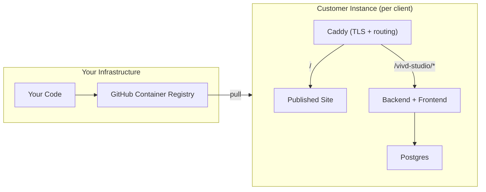
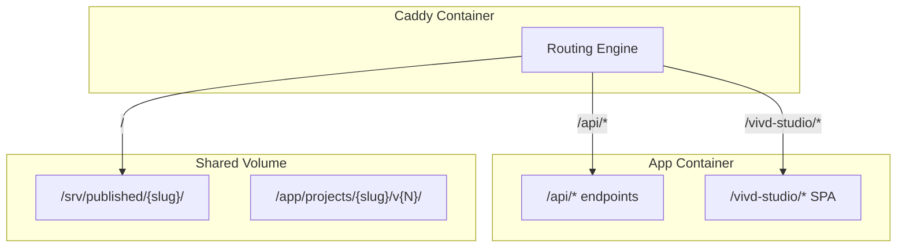

# Vivd: Product Roadmap

> Single-tenant, managed-first AI website builder

---

## Architecture Overview



**Key decisions**:

- ✅ Single-tenant (one instance per customer, one published site)
- ✅ Backend serves frontend (2 containers: App + Caddy)
- ✅ GHCR for private image distribution
- ✅ Path-based admin (`acme.com/vivd-studio`)
- ✅ Project limit controlled by `LICENSE_MAX_PROJECTS` (default: 1)

---

## Phase 1: Core Product Polish ✅ (Completed)

### 1.1 Project Creation Flow ✅

- [x] Create `ProjectWizard` component with step flow
- [x] **URL flow**: Legal disclaimer checkbox + existing generation pipeline
- [ ] **Scratch flow** (coming soon placeholder added)

### 1.2 Chat UX Improvements ✅

- [x] Element selector mode with XPath
- [x] Empty state prompt
- [x] Clear visual feedback for success/error states
- [x] `postMessage` bridge for iframe → parent element selection

---

## Phase 2: Save, Publish & Caddy Integration (Current Focus)

> Git-based versioning with publish-to-production flow

### 2.1 Git-Based Save System

**Concepts**:

- **Working copy**: Current edits (auto-saved to files, uncommitted)
- **Save**: Git commit with message (creates a version)
- **Load**: Checkout a specific commit/version

**Terminology**:

- **Working** → Current uncommitted changes you're editing (live preview)
- **Saved** → A git commit (versioned snapshot)
- **Published** → The version deployed to production (Caddy)

**User flow**:

```
┌─────────────────────────────────────────────┐
│ Project: acme-corp                  [Save ▼]│
│                                             │
│ ⚡ Working (unsaved changes)                │
│                                             │
│ Version History                             │
│ ├── "Updated hero text"   10:30  📦 Published│
│ ├── "New contact section" 09:15             │
│ └── "Initial version"     08:00             │
│                                             │
│        [Load Version]  [Publish Latest]     │
└─────────────────────────────────────────────┘
```

**Tasks**:

#### Backend: Git Operations

- [ ] **Create `GitService` module** (`backend/src/services/GitService.ts`)

  - [ ] `save({ slug, message })` → `git add . && git commit -m "message"`
  - [ ] `getHistory({ slug })` → `git log --oneline --format=json`
  - [ ] `loadVersion({ slug, commitHash })` → `git checkout <hash> -- .`
  - [ ] `getCurrentCommit({ slug })` → `git rev-parse HEAD`
  - [ ] `hasUncommittedChanges({ slug })` → `git status --porcelain`

- [ ] **Project Router Endpoints** (`backend/src/routers/project.ts`)
  - [ ] `project.save` → commit with message
  - [ ] `project.history` → list versions (commits)
  - [ ] `project.loadVersion` → checkout specific version
  - [ ] `project.hasChanges` → check for uncommitted changes

#### Frontend: Version UI

- [ ] **VersionHistoryPanel** component

  - [ ] Show "Working" state at top if uncommitted changes exist
  - [ ] List of commits with hash, message, date
  - [ ] "📦 Published" tag on the deployed version
  - [ ] "Load" button per version
  - [ ] "Current" indicator for checked-out version

- [ ] **SaveVersionDialog** component

  - [ ] Text input for commit message
  - [ ] Shows diff summary (files changed)
  - [ ] Save button

- [ ] **Toolbar integration**
  - [ ] "Save" button in preview toolbar
  - [ ] Version history drawer toggle
  - [ ] Uncommitted changes indicator

---

### 2.2 Caddy Integration

> Add Caddy as reverse proxy and static file server

**Architecture**:



**Tasks**:

#### Docker Configuration

- [ ] **Add Caddy service** to `docker-compose.yml`

  ```yaml
  caddy:
    image: caddy:2-alpine
    ports:
      - "80:80"
      - "443:443"
    volumes:
      - ./Caddyfile:/etc/caddy/Caddyfile
      - caddy_data:/data
      - published_sites:/srv/published
    depends_on:
      - backend
  ```

- [ ] **Create Caddyfile** (`/Caddyfile`)

  ```caddyfile
  {$DOMAIN:localhost} {
      # Admin panel + API (all under /vivd-studio/*)
      handle /vivd-studio/* {
          reverse_proxy backend:3000
      }

      # Published site (static files)
      handle {
          root * /srv/published
          try_files {path} {path}/ /index.html
          file_server
      }
  }
  ```

- [ ] **Add shared volumes**
  - `published_sites:/srv/published` (Caddy reads)
  - Mount same volume to backend for publishing

---

### 2.3 Publish Workflow

> Deploy specific version to production (Caddy-served root)

**Tasks**:

- [ ] **Backend: Publish Service**

  - [ ] `publish({ slug, commitHash? })` → copy version files to `/srv/published/{slug}/`
  - [ ] Store published commit hash in manifest
  - [ ] Create git tag for published versions (e.g., `published-{timestamp}`)

- [ ] **Frontend: Publish UI**

  - [ ] "Publish" button (publishes current/selected version)
  - [ ] Published version indicator in history
  - [ ] Confirmation dialog before publishing
  - [ ] "View Live Site" link to root domain

- [ ] **Manifest extension**
  - [ ] Add `publishedCommit: string | null` to manifest
  - [ ] Add `publishedAt: string | null` timestamp

---

## Phase 3: Scratch Project Flow & Licensing

### 3.1 Scratch Project Flow

> Generate site from business description (no source URL)

**Tasks**:

- [ ] **Wizard steps**:

  - [ ] Step 1: Business type, name, industry
  - [ ] Step 2: Upload existing assets (logo, images) or generate
  - [ ] Step 3: Color/style preferences
  - [ ] Step 4: AI generates full site

- [ ] **Backend**: Adapt `processUrl` to `generateProject({ type: 'scratch' | 'url', ... })`

---

### 3.2 Feature Licensing System

> Control what each instance can do (env-first, license-server later)

**Restricted features**:

| Feature                | Env Var | Default                              |
| ---------------------- | ------- | ------------------------------------ |
| `LICENSE_IMAGE_GEN`    | `true`  | Image generation enabled             |
| `LICENSE_MAX_PROJECTS` | `1`     | Sites per instance (1 for customers) |
| `LICENSE_MAX_USERS`    | `3`     | Team members                         |

**AI rate limits**:

| Env Var                        | Default    | Purpose           |
| ------------------------------ | ---------- | ----------------- |
| `LICENSE_AI_TOKENS_PER_MINUTE` | `500000`   | Burst protection  |
| `LICENSE_AI_TOKENS_PER_MONTH`  | `10000000` | Monthly cap       |
| `LICENSE_AI_REQUESTS_PER_DAY`  | `200`      | Request throttle  |
| `LICENSE_IMAGE_GEN_PER_DAY`    | `20`       | Daily image limit |
| `LICENSE_IMAGE_GEN_PER_MONTH`  | `50`       | Monthly image cap |

**Tasks**:

- [ ] Create `LicenseService` in backend
  - [ ] Read limits from env vars
  - [ ] Check limits before operations
  - [ ] Return 402/upgrade-required when exceeded
- [ ] **Token tracking**:
  - [ ] Hook into OpenCode task events
  - [ ] Store cumulative usage per month in DB
- [ ] **Image generation tracking**:
  - [ ] Wrap image gen calls with counter
- [ ] Frontend: show usage stats in admin dashboard
- [ ] Frontend: graceful "limit reached" messaging

**Future**: Add license server verification for non-managed customers

---

## Phase 4: Distribution Infrastructure

### 4.1 Container Registry Setup

> Push images to GHCR for customer distribution

**GitHub Actions workflow** (`.github/workflows/publish.yml`):

```yaml
name: Build and Push
on:
  push:
    tags: ["v*"]

jobs:
  build:
    runs-on: ubuntu-latest
    steps:
      - uses: actions/checkout@v4

      - name: Login to GHCR
        uses: docker/login-action@v3
        with:
          registry: ghcr.io
          username: ${{ github.actor }}
          password: ${{ secrets.GITHUB_TOKEN }}

      - name: Build and push backend
        uses: docker/build-push-action@v5
        with:
          context: ./backend
          push: true
          tags: |
            ghcr.io/${{ github.repository }}/vivd:${{ github.ref_name }}
            ghcr.io/${{ github.repository }}/vivd:latest

      # Similar for frontend
```

**Tasks**:

- [ ] Create GitHub Actions workflow
- [ ] Make images private in GHCR settings
- [ ] Create "customer template" docker-compose (uses `image:` not `build:`)
- [ ] Document customer onboarding (PAT generation, docker login)
- [ ] Test full cycle: push → pull on clean server

---

### 4.2 Update Strategy

> How customers get updates

**Options implemented**:

1. **Manual** (default): Pin to version tag, customer decides when to update
2. **Watchtower** (optional): Auto-pull on schedule

**Customer compose with Watchtower**:

```yaml
services:
  watchtower:
    image: containrrr/watchtower
    volumes:
      - /var/run/docker.sock:/var/run/docker.sock
    environment:
      - WATCHTOWER_POLL_INTERVAL=86400
      - WATCHTOWER_CLEANUP=true
      - WATCHTOWER_INCLUDE_STOPPED=true
    command: --label-enable

  app:
    image: ghcr.io/you/vivd:latest
    labels:
      - "com.centurylinklabs.watchtower.enable=true"
```

**Tasks**:

- [ ] Add watchtower to template compose (commented, opt-in)
- [ ] Create `CHANGELOG.md` format
- [ ] Add version display in admin UI
- [ ] Consider: Webhook to notify you when customer updates

---

## Phase 5: Future Enhancements

- [ ] **Template gallery**: Pre-built starting points
- [ ] **Multi-site publishing**: Multiple domains from one instance
- [ ] **Customer billing dashboard**: If moving to self-service
- [ ] **License server**: For non-managed deployments
- [ ] **Master dashboard**: Your view across all customer instances
- [ ] **Chat refactoring**: Review and split chat panel into smaller components

---

## Quick Reference

### Priority Order (Updated)

```
1. ✅ Project Wizard (URL flow)          ← Done
2. ✅ Chat UX (element selector)         ← Done
3. 🔄 Git-based Save/Load workflow       ← CURRENT
4. 🔄 Caddy integration                  ← CURRENT
5. 🔄 Publish workflow                   ← CURRENT
6. ⏳ Scratch project flow               ← Next
7. ⏳ Licensing (env vars)               ← Enables sales
8. ⏳ GHCR + Actions                     ← Distribution
```

### File Changes Summary

| Path                                              | Change                         |
| ------------------------------------------------- | ------------------------------ |
| `backend/src/services/GitService.ts`              | NEW - git operations           |
| `backend/src/routers/project.ts`                  | MODIFY - add save/load/publish |
| `frontend/src/components/VersionHistoryPanel.tsx` | NEW - version list UI          |
| `frontend/src/components/SaveVersionDialog.tsx`   | NEW - commit dialog            |
| `docker-compose.yml`                              | MODIFY - add Caddy             |
| `Caddyfile`                                       | NEW - routing config           |
| `backend/src/services/LicenseService.ts`          | NEW - feature limits           |
| `backend/src/services/UsageTracker.ts`            | NEW - token/image counting     |
| `.github/workflows/publish.yml`                   | NEW - image build/push         |
| `docker-compose.customer.yml`                     | NEW - customer template        |
