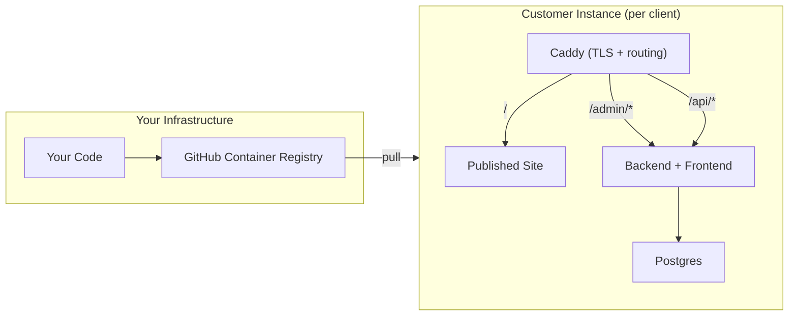

# Vivd: Product Roadmap

> Single-tenant, managed-first AI website builder

---

## Architecture Overview



**Key decisions**:

- ✅ Single-tenant (one instance per customer, one published site)
- ✅ Backend serves frontend (2 containers: App + Caddy)
- ✅ GHCR for private image distribution
- ✅ Path-based admin (`acme.com/admin`)
- ✅ Multi-project dashboard only for your dev instance

---

## Phase 1: Core Product Polish

### 1.1 Project Creation Flow

> Choice-based wizard; customers land directly here if no site exists

**Dashboard behavior**:

- `MULTI_PROJECT_DASHBOARD=true` → Shows project list (your dev instance)
- `MULTI_PROJECT_DASHBOARD=false` → Direct to admin view or start wizard

**Start flow** (when no site exists or "New Project"):

```
┌─────────────────────────────────────┐
│  How do you want to start?          │
│                                     │
│  ○ Start from scratch               │
│    Describe your business and we'll │
│    create everything from zero      │
│                                     │
│  ○ Start from existing website      │
│    We'll analyze and recreate it    │
│    ⚠️ Only use websites you own     │
└─────────────────────────────────────┘
```

**Tasks**:

- [ ] Create `ProjectWizard` component with step flow
- [ ] **Scratch flow**:
  - [ ] Step 1: Business type, name, industry
  - [ ] Step 2: Upload existing assets (logo, images) or generate
  - [ ] Step 3: Color/style preferences
  - [ ] Step 4: AI generates full site (logo if needed, hero image, content)
- [ ] **URL flow** (current):
  - [ ] Add legal disclaimer checkbox: "I own this website and its content"
  - [ ] Existing generation pipeline
- [ ] Adapt `processUrl` to `generateProject({ type: 'scratch' | 'url', ... })`

---

### 1.2 Chat UX Improvements

> Make AI editing intuitive for non-technical users

**Features**:

- [ ] **Element selector mode**:
  - Click "Select Element" → cursor becomes crosshair
  - Click any element in preview → highlight + send selector to chat
  - Auto-message: "I want to change [element description]"
- [ ] **Empty state prompt**:
  ```
  "👋 Hi! Click any element in the preview to tell me what
   you'd like to change, or just describe what you need."
  ```
- [ ] **Simplify success/error states** - clear visual feedback

**Implementation**:

- [ ] Add `postMessage` bridge for iframe → parent element selection
- [ ] Store selected element XPath/selector in chat context
- [ ] Create `EmptyStatePrompt` component

---

### 1.3 Feature Licensing System

> Control what each instance can do (env-first, license-server later)

**Restricted features**:
| Feature | Env Var | Default |
|---------|---------|---------|
| `LICENSE_IMAGE_GEN` | `true` | Image generation enabled |
| `MULTI_PROJECT_DASHBOARD` | `false` | Show project list (your instance only) |
| `LICENSE_MAX_PROJECTS` | `1` | Sites per instance (1 for customers) |
| `LICENSE_MAX_USERS` | `3` | Team members |

**AI rate limits**:
| Env Var | Default | Purpose |
|---------|---------|---------||
| `LICENSE_AI_TOKENS_PER_MINUTE` | `500000` | Burst protection |
| `LICENSE_AI_TOKENS_PER_MONTH` | `10000000` | Monthly cap |
| `LICENSE_AI_REQUESTS_PER_DAY` | `200` | Request throttle |
| `LICENSE_IMAGE_GEN_PER_DAY` | `20` | Daily image limit |
| `LICENSE_IMAGE_GEN_PER_MONTH` | `50` | Monthly image cap |

**Tasks**:

- [ ] Create `LicenseService` in backend
  - [ ] Read limits from env vars
  - [ ] Check limits before operations
  - [ ] Return 402/upgrade-required when exceeded
- [ ] **Token tracking**:
  - [ ] Hook into OpenCode task events
  - [ ] Store cumulative usage per month in DB
- [ ] **Image generation tracking**:
  - [ ] Wrap image gen calls with counter
- [ ] Frontend: show usage stats in admin dashboard
- [ ] Frontend: graceful "limit reached" messaging

**Future**: Add license server verification for non-managed customers

---

## Phase 2: Deployment & Publishing

### 2.1 Save & Publish Workflow

> Git-based versioning with publish-to-production flow

**Concepts**:

- **Working copy**: Current edits (auto-saved to files)
- **Save**: Git commit with message
- **Publish**: Deploy specific version to production

**User flow**:

```
┌─────────────────────────────────────┐
│ Project: acme-corp          [Save ▼]│
│                                     │
│ Unpublished changes (3 saves)       │
│ ├── "Updated hero text"     10:30   │
│ ├── "New contact section"   09:15   │
│ └── "Initial version"       ★ Live  │
│                                     │
│           [Publish Latest]          │
└─────────────────────────────────────┘
```

**Tasks**:

- [ ] **Backend: Git operations**
  - [ ] `project.save({ message })` → `git add . && git commit`
  - [ ] `project.listSaves()` → `git log --oneline`
  - [ ] `project.revert({ commitHash })` → `git checkout`
  - [ ] `project.publish()` → copy to published folder + tag
- [ ] **Frontend: Save UI**
  - [ ] "Save" button with commit message prompt
  - [ ] Version history drawer
  - [ ] "Published" indicator on versions
- [ ] **Published site serving**:
  - [ ] Published versions go to `/srv/published/{slug}/`
  - [ ] Caddy serves from published folder
  - [ ] Preview continues from working folder

---

### 2.2 Caddy Integration

> Add static file server to docker-compose

**New service in docker-compose**:

```yaml
services:
  caddy:
    image: caddy:2-alpine
    ports:
      - "80:80"
      - "443:443"
    volumes:
      - ./Caddyfile:/etc/caddy/Caddyfile
      - caddy_data:/data
      - published_sites:/srv/published
    depends_on:
      - app

  app:
    image: ghcr.io/you/vivd:latest
    # Backend serves both API and frontend
```

**Caddyfile template**:

```caddyfile
{$DOMAIN} {
    # API routes
    handle /api/* {
        reverse_proxy app:3000
    }

    # Admin panel (served by app)
    handle /admin/* {
        reverse_proxy app:3000
    }

    # Published site (static files)
    handle {
        root * /srv/published
        file_server
    }
}
```

**Tasks**:

- [ ] Add Caddy service to docker-compose
- [ ] Create Caddyfile template
- [ ] Add `published_sites` volume
- [ ] Implement publish sync (copy from working to published)
- [ ] Handle domain config per customer

---

## Phase 3: Distribution Infrastructure

### 3.1 Container Registry Setup

> Push images to GHCR for customer distribution

**GitHub Actions workflow** (`.github/workflows/publish.yml`):

```yaml
name: Build and Push
on:
  push:
    tags: ["v*"]

jobs:
  build:
    runs-on: ubuntu-latest
    steps:
      - uses: actions/checkout@v4

      - name: Login to GHCR
        uses: docker/login-action@v3
        with:
          registry: ghcr.io
          username: ${{ github.actor }}
          password: ${{ secrets.GITHUB_TOKEN }}

      - name: Build and push backend
        uses: docker/build-push-action@v5
        with:
          context: ./backend
          push: true
          tags: |
            ghcr.io/${{ github.repository }}/vivd:${{ github.ref_name }}
            ghcr.io/${{ github.repository }}/vivd:latest

      # Similar for frontend
```

**Tasks**:

- [ ] Create GitHub Actions workflow
- [ ] Make images private in GHCR settings
- [ ] Create "customer template" docker-compose (uses `image:` not `build:`)
- [ ] Document customer onboarding (PAT generation, docker login)
- [ ] Test full cycle: push → pull on clean server

---

### 3.2 Update Strategy

> How customers get updates

**Options implemented**:

1. **Manual** (default): Pin to version tag, customer decides when to update
2. **Watchtower** (optional): Auto-pull on schedule

**Customer compose with Watchtower**:

```yaml
services:
  watchtower:
    image: containrrr/watchtower
    volumes:
      - /var/run/docker.sock:/var/run/docker.sock
    environment:
      - WATCHTOWER_POLL_INTERVAL=86400
      - WATCHTOWER_CLEANUP=true
      - WATCHTOWER_INCLUDE_STOPPED=true
    command: --label-enable

  app:
    image: ghcr.io/you/vivd:latest
    labels:
      - "com.centurylinklabs.watchtower.enable=true"
```

**Tasks**:

- [ ] Add watchtower to template compose (commented, opt-in)
- [ ] Create `CHANGELOG.md` format
- [ ] Add version display in admin UI
- [ ] Consider: Webhook to notify you when customer updates

---

## Phase 4: Future Enhancements

- [ ] **Template gallery**: Pre-built starting points
- [ ] **Multi-site publishing**: Multiple domains from one instance
- [ ] **Customer billing dashboard**: If moving to self-service
- [ ] **License server**: For non-managed deployments
- [ ] **Master dashboard**: Your view across all customer instances

---

## Quick Reference

### File Changes Summary

| Path                                                | Change                     |
| --------------------------------------------------- | -------------------------- |
| `frontend/src/components/ProjectWizard.tsx`         | NEW - wizard flow          |
| `frontend/src/components/chat/ElementSelector.tsx`  | NEW - click-to-select      |
| `frontend/src/components/chat/EmptyStatePrompt.tsx` | NEW - empty state          |
| `backend/src/services/LicenseService.ts`            | NEW - feature limits       |
| `backend/src/services/UsageTracker.ts`              | NEW - token/image counting |
| `backend/src/routers/project.ts`                    | MODIFY - add save/publish  |
| `docker-compose.yml`                                | MODIFY - add Caddy         |
| `Caddyfile`                                         | NEW - routing config       |
| `.github/workflows/publish.yml`                     | NEW - image build/push     |
| `docker-compose.customer.yml`                       | NEW - customer template    |

### Priority Order

```
1. Project Wizard (scratch + URL)     ← Enables core product
2. Chat UX (element selector)         ← Usability
3. Licensing (env vars)               ← Enables sales
4. Save/Publish workflow              ← Production readiness
5. Caddy integration                  ← Customer deployment
6. GHCR + Actions                     ← Distribution
```
