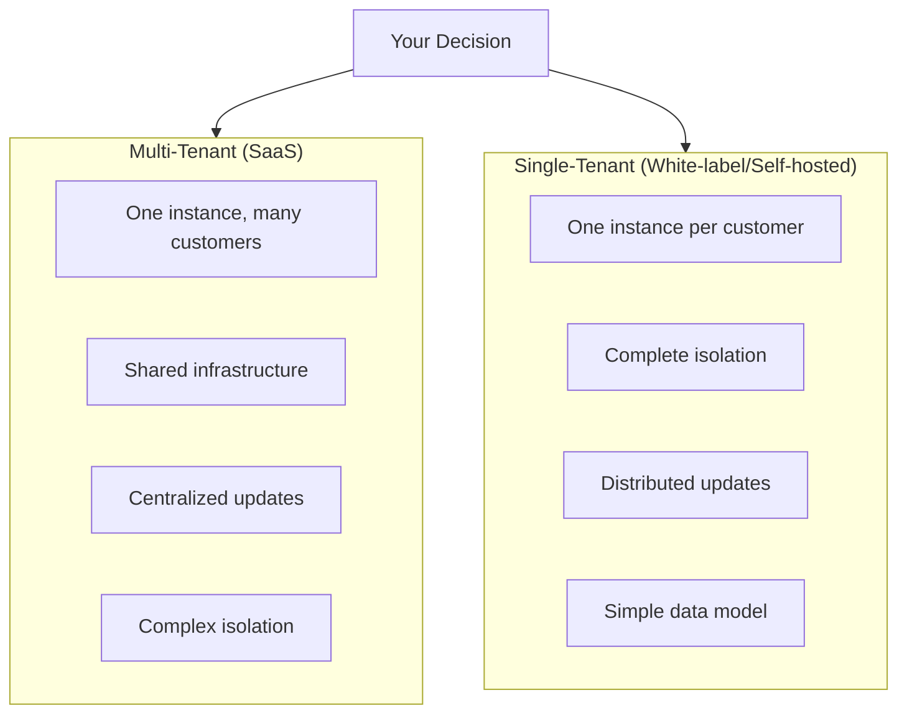
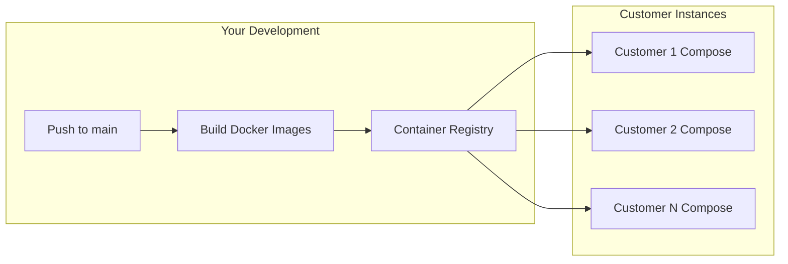

# Strategic Product Direction: AI-Powered CMS Architecture

## Current State Summary

You've built a **language-driven website generator/CMS** with these components:

- **Entry**: URL → scrape → AI-generate new website
- **Editing**: Agent chat, visual text editing, asset management
- **Auth**: `admin` (full access) and `user` (create/edit sites) roles
- **Storage**: File-based (`generated/{slug}/v{n}/`) with versioning
- **Deployment**: Single docker-compose on Dokploy

---

## The Core Decision: Single-Tenant vs Multi-Tenant



### WordPress Reference

| Aspect        | WordPress.com (Multi-tenant) | WordPress.org (Single-tenant)    |
| ------------- | ---------------------------- | -------------------------------- |
| Hosting       | Automattic hosts everything  | Customer self-hosts              |
| Updates       | Automatic, centralized       | Manual or automated per instance |
| Customization | Limited by tier              | Unlimited                        |
| Revenue Model | Subscription tiers           | License/support/hosting services |

---

## Recommended Path: Single-Tenant First

> [!IMPORTANT] > **My recommendation**: Start with single-tenant. It's simpler, lower-risk, and you can always add multi-tenant later. Here's why:

### Why Single-Tenant First?

| Factor                 | Single-Tenant ✅                       | Multi-Tenant ❌                            |
| ---------------------- | -------------------------------------- | ------------------------------------------ |
| **Complexity**         | Keep current architecture nearly as-is | Requires tenant isolation, billing, quotas |
| **Security**           | Complete isolation by default          | Need careful RLS/data separation           |
| **Your Overview Page** | Keep it! Each instance has their own   | Need to scope everything by tenant         |
| **Deployment**         | Dokploy compose per customer           | Complex shared infra                       |
| **Time to Market**     | Weeks                                  | Months                                     |

---

## Structured Decision Framework

### 1. Entrypoint Question

**"Is URL → generate the right entry?"**

| Option                   | Pros                          | Cons                      |
| ------------------------ | ----------------------------- | ------------------------- |
| **Keep URL entry**       | Fast start, clear value prop  | Limited to existing sites |
| **Add template gallery** | Accessible to non-site owners | More upfront work         |
| **Blank canvas**         | Maximum flexibility           | Higher barrier to start   |

> [!TIP] > **Recommendation**: Keep URL as primary, add templates as enhancement later.

---

### 2. User Roles for Single-Tenant

For single-tenant, you likely **don't need a new "customer" role**. Instead:

```
Instance Owner (your current "admin")
  └── Can manage users, settings, billing
  └── Can create/edit all sites

Team Members (your current "user")
  └── Can create/edit sites (scoped as needed)
```

The "customer" concept becomes: **each customer gets their own instance**.

---

### 3. Deployment Strategy



**Implementation path**:

1. **Short term**: Keep developing on your instance, publish images to a registry
2. **Per customer**: Create Dokploy compose that pulls your images with `image:` instead of `build:`
3. **Updates**: Customer composes pull `:latest` or tagged versions
4. **Serving**: Add Caddy/Nginx to each compose for static site serving

---

### 4. Your Overview Page

| Scenario                         | Where it lives                                                        |
| -------------------------------- | --------------------------------------------------------------------- |
| Single-tenant                    | **Stays exactly where it is** in each customer's instance             |
| If you want a "master dashboard" | Build a separate admin tool that aggregates across instances (future) |

---

### 5. Versioning & Updates

**Suggested approach**:

```yaml
# Customer docker-compose.yml
services:
  backend:
    image: your-registry/landing-page-agent-backend:v1.2.3
    # ... rest of config
```

| Update Strategy                 | Complexity | Customer Control              |
| ------------------------------- | ---------- | ----------------------------- |
| `:latest` auto-pull             | Low        | Low (they always get updates) |
| Semantic versioning (`:v1.2.3`) | Medium     | High (they choose when)       |
| Watchtower auto-update          | Low        | Medium (auto but controlled)  |

---

## Recommended Next Steps (Prioritized)

### Phase 1: Production-Ready Single Instance (Current Priority)

- [ ] Add static file serving to docker-compose (Caddy/Nginx sidecar)
- [ ] Define how "published" sites are served vs "preview"
- [ ] Document deployment for your first customer (yourself or a pilot)

### Phase 2: Reproducible Customer Deployment

- [ ] Push images to a container registry (GitHub Container Registry is free)
- [ ] Create a "customer template" docker-compose that uses `image:`
- [ ] Document customer onboarding process

### Phase 3: Update Mechanism

- [ ] Decide on versioning strategy (semantic tags recommended)
- [ ] Consider Watchtower or similar for opt-in auto-updates
- [ ] Create changelog/release notes process

### Phase 4: Future (Only if needed)

- [ ] Multi-tenant conversion (only if SaaS model becomes primary)
- [ ] Master dashboard across instances

---

## Questions for You

1. **Who is your first customer?** (Yourself? A pilot client?) This shapes priorities.

2. **Serving finished sites**: Do customers want their sites served from this same system, or exported and hosted elsewhere (Netlify, Vercel, their own server)?

3. **Your business model**:

   - One-time setup fee + hosting?
   - Monthly subscription per instance?
   - This affects whether you even need multi-tenant

4. **Development pace**: How often do you expect to push breaking changes that would require customer coordination?
