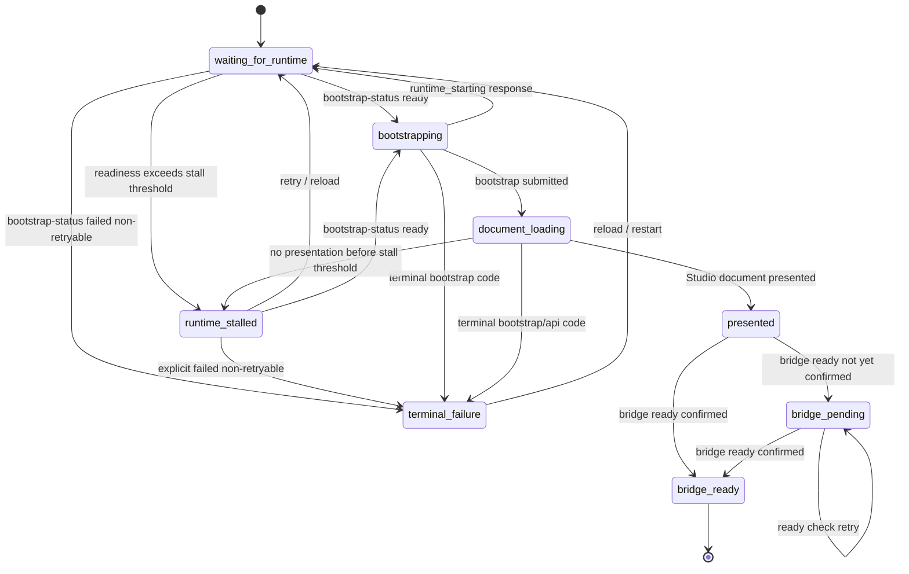

# Studio Startup Contract Plan

Date: 2026-04-27
Owner: frontend/studio
Status: implemented

Implementation note: the core startup contract landed on 2026-04-27.
Studio now exposes structured bootstrap readiness and bootstrap failure
responses, the host gates browser bootstrap on readiness, Studio emits an early
`vivd:studio:presented` bridge signal, and startup stalls stay on the startup
UI path instead of terminal recovery.

Remaining follow-ups:

- Keep the legacy text/iframe compatibility heuristics until the deployed
  Studio image fleet has the startup-stub and bootstrap-status contract.
- The rebuilt local Studio image passed the startup/bootstrap portion of
  `STUDIO_IMAGE=vivd-studio:local npm run studio:host-smoke`, but the smoke
  later timed out waiting for initial-generation progress. Track that as a
  separate Studio generation/runtime smoke issue, not as a startup-contract
  blocker.

## Why This Exists

Vivd currently has intermittent Studio startup failures that all point at the same missing contract:

- cold-started runtimes can briefly serve a startup stub or bootstrap error document inside the iframe
- long cold starts can leave the user on a black or white iframe surface instead of an intentional Vivd loading state
- the host can keep the loading overlay mounted even after Studio is already visible or interactive underneath
- browser refresh can appear to "fix" the issue because the runtime is warm by then and the iframe reaches Studio through a different timing path

The current mitigation relies on retries, iframe inspection, text-based error classification, and a short grace window before showing recovery UI. That helps reduce flashes, but it is not a clean system. The long-term contract should make startup boring:

- the host owns the visible surface until Studio is either clearly presented or explicitly failed
- the browser does not submit bootstrap while the runtime says bootstrap cannot succeed yet
- startup and bootstrap responses are structured, classified, and stable
- once Studio is presented, the host never covers it again with a blocking startup overlay just because a later ready signal is delayed

## Problem Summary

Today the host can submit the bootstrap form before the runtime is ready to accept it. During that window:

- the startup stub in `packages/studio/entrypoint.sh` only returns structured JSON for `/health`
- non-health routes, including the bootstrap route, can return a plain 503 startup document
- the real bootstrap handler can return a generic `Studio bootstrap unavailable` response when runtime auth env is missing
- the frontend has to infer whether an iframe document is retryable startup, a terminal bootstrap failure, or a normal Studio document

The host also has the opposite failure mode:

- the iframe may already contain a Studio shell
- the Studio React app may already be mounted and usable
- a missed or delayed ready event can leave the loading overlay covering Studio until a browser refresh

The right fix is a narrow startup protocol, not more timing grace:

- startup is a retryable state, not an error
- bootstrap only starts after explicit bootstrap readiness
- terminal failures use explicit codes and do not depend on message text
- presentation and bridge readiness are separate host states
- timeouts can create a startup-stall state, but timeout alone does not create a terminal failure

## Goals

- Prevent normal cold start from showing recovery UI.
- Prevent raw startup, bootstrap, unauthorized, or JSON error documents from becoming the only user-visible iframe surface.
- Keep an intentional Vivd-owned surface visible during ambiguity: loading, startup stall, visible Studio, or terminal recovery.
- Reveal Studio as soon as there is strong evidence that a Studio document is presented.
- Keep Studio revealed if later bridge or ready checks are late.
- Classify retryable startup, startup stall, bridge delay, and terminal failure as distinct states.
- Move frontend failure handling from free-text heuristics to structured runtime/bootstrap contracts.
- Keep fallback parsing only for older runtime shapes and local compatibility during rollout.

## Non-Goals

- Do not redesign the broader Studio preview architecture in this plan.
- Do not change the existing Studio loading skeleton visuals except where needed to add a startup-stall treatment.
- Do not redefine Studio dev-server readiness or preview readiness.
- Do not remove existing shell-detection, ready-retry, or raw-error shielding until the replacement contract is live and tested.
- Do not present startup stalls as "session could not be restored"; that copy is only for classified terminal bootstrap/auth failures.

## Design Principles

1. Normal startup is not an error.
2. The iframe is not the startup state machine; it is only the final presentation surface.
3. Bootstrap readiness and process health are related but not identical.
4. Bootstrap failure semantics must come from stable codes, not English messages.
5. `presented`, `bridge_ready`, and any future editor-specific readiness are different states.
6. Once Studio is presented, startup overlays are done; later ready delays become non-blocking bridge states.
7. Timeout without an explicit terminal signal means "still starting or stalled", not "failed".
8. Cross-origin opacity must make the host more conservative, not less.

## Target Contract

### Runtime Readiness Contract

The Studio runtime must expose an unauthenticated, no-store, CORS-readable answer to:

`Can this runtime accept browser bootstrap now?`

Use a dedicated route for the browser handoff contract:

- `GET /vivd-studio/api/bootstrap-status`

Keep `/health` for provider/process readiness and compatibility, but do not make the browser infer bootstrap semantics from general health forever. During rollout, `/health` can continue to return enough data for existing provider waits:

```json
{
  "status": "starting",
  "initialized": false
}
```

`/vivd-studio/api/bootstrap-status` should return:

```json
{
  "status": "starting",
  "code": "runtime_starting",
  "retryable": true,
  "canBootstrap": false,
  "message": "Studio is starting"
}
```

Required readiness statuses:

- `starting`
  The stub or runtime is alive, but browser bootstrap must not run yet.
- `ready`
  The runtime is ready to accept bootstrap and redirect to Studio.
- `failed`
  The runtime has a classified terminal startup/configuration problem.

Required response rules:

- `Content-Type: application/json`
- `Cache-Control: no-store`
- `Access-Control-Allow-Origin: *` for `GET` status reads
- optional `Retry-After` on retryable startup responses
- no authentication requirement, because this is checked before Studio auth cookies exist

Probe URL selection:

- prefer the same-origin compatibility URL when the backend provides one
- fall back to the direct runtime URL only when no same-origin compatibility URL exists
- require the startup stub and real runtime to make status probes CORS-readable for direct-runtime fallback
- if both compatibility and direct probes exist, a same-origin compatibility `ready` answer wins because it matches the URL the iframe will use

### Bootstrap Response Contract

The bootstrap route should still be a form-post target because it sets auth cookies and redirects the iframe, but every non-redirect outcome must be structured and classified.

Payload shape:

```json
{
  "status": "failed",
  "code": "invalid_bootstrap_token",
  "retryable": false,
  "message": "Invalid bootstrap token"
}
```

Allowed codes for the first implementation:

| Code | HTTP | Retryable | Meaning |
| --- | ---: | --- | --- |
| `runtime_starting` | 503 | true | Stub or real runtime is alive but not ready for bootstrap. |
| `bootstrap_unconfigured` | 503 | false | Runtime is healthy enough to answer, but required bootstrap env such as `STUDIO_ACCESS_TOKEN` or `STUDIO_ID` is missing. |
| `missing_bootstrap_token` | 400 | false | Form did not include a bootstrap token. |
| `missing_bootstrap_target` | 400 | false | Form did not include a target path. |
| `invalid_bootstrap_token` | 401 | false | Token verification failed. |
| `invalid_bootstrap_target` | 400 | false | Target is outside the allowed Studio runtime path. |
| `unauthorized` | 401 | false | A protected runtime route was reached without valid Studio auth. |
| `internal_error` | 500 | false | Unexpected server-side bootstrap failure. |

Required behavior:

- successful bootstrap still returns a `303` redirect to the sanitized Studio target
- retryable startup responses include `retryable: true`, a stable `code`, JSON content type, no-store, and optional `Retry-After`
- terminal failures include `retryable: false` and a stable `code`
- `Studio bootstrap unavailable` must no longer be a catch-all classification; missing env after runtime readiness is `bootstrap_unconfigured`
- the frontend may display `message`, but it must classify by `code` and `retryable`
- plain text startup output remains only as rollout compatibility, never as the primary contract

### Host Display Contract

The host should track an explicit startup state instead of deriving UI from several booleans:

- `waiting_for_runtime`
- `runtime_stalled`
- `bootstrapping`
- `document_loading`
- `presented`
- `bridge_pending`
- `bridge_ready`
- `terminal_failure`

User-facing behavior:

- `waiting_for_runtime`: show the normal startup loading skeleton
- `runtime_stalled`: show startup-adjacent stall UI, not terminal recovery
- `bootstrapping`: keep the startup loading skeleton over the iframe
- `document_loading`: keep the startup loading skeleton until Studio presentation is proven
- `presented`: reveal Studio immediately
- `bridge_pending`: keep Studio revealed and continue bridge checks in the background
- `bridge_ready`: normal Studio state
- `terminal_failure`: show the recovery panel

Visibility guarantee:

- the host always renders one intentional surface: startup loading, startup stall, visible Studio, or terminal recovery
- a blank, white, black, stub, unauthorized, or JSON error iframe document must never be the only visible output during startup
- terminal recovery is only for explicit terminal codes or provider start failures, not for "took too long"

## Proposed State Machine



Important rule: there is no transition from `presented` or `bridge_pending` back to a blocking startup overlay. If Studio is visible, late bridge readiness can only produce background retries or a non-blocking degraded indicator.

## Readiness and Presentation Rules

The host must stop treating `ready` as the only success signal.

### `presented` Should Be Triggered By

- same-origin iframe document inspection that finds a Studio route plus mounted root or Studio assets
- `vivd:studio:presented`, a new early bridge event emitted as soon as the Studio app shell mounts enough to own the viewport
- `vivd:studio:ready`, which implies presentation
- same-origin shell-ready checks that prove the Studio root is mounted

### Cross-Origin Presentation Rule

Cross-origin iframe navigation away from `about:blank` is not enough by itself during bootstrapped startup. The host cannot inspect whether the cross-origin document is Studio, an auth error, or a JSON bootstrap failure.

For cross-origin runtime fallback:

- keep the startup overlay until a bridge `presented` or `ready` event arrives
- if no bridge event arrives before the stall threshold, show `runtime_stalled`, not terminal recovery
- only reveal on cross-origin navigation alone when there was no bootstrap form involved and the target URL was already a trusted Studio route with existing auth, and even then keep ready-check retries active

This makes the common path safer because Vivd should prefer same-origin compatibility URLs for embedded Studio whenever they are available.

### `bridge_ready` Should Be Triggered By

- `vivd:studio:ready`
- an answer to a host ready check
- a same-origin shell-ready check that proves the Studio app is mounted and responsive enough for host bridge sync

For the current codebase, `vivd:studio:ready` should mean "Studio app/bridge is ready", not "all editor subsystems are done". If future work needs deeper readiness, add a new event such as `vivd:studio:editor-ready` instead of overloading the existing bridge event.

## Failure Taxonomy

### Startup / Transient

These stay on the startup path and must not surface terminal recovery:

- `runtime_starting`
- status probe network errors while still inside the startup budget
- about:blank before bootstrap submission
- retryable bootstrap response with `retryable: true`
- document load still pending after bootstrap submission
- Studio presented but bridge readiness is still pending

### Runtime Stalled

This is not a terminal error.

Definition:

- startup has exceeded the stall threshold
- no Studio presentation signal has arrived
- there is no explicit terminal runtime/bootstrap code

User treatment:

- keep the loading visual language
- acknowledge that startup is taking longer than usual
- offer `Reload`
- offer `Hard restart` only when the current surface is backed by a managed machine/container where restart is meaningful
- continue readiness probes in the background so a slow runtime can still advance without manual refresh

### Bridge Pending / Degraded

This is not a startup failure.

Definition:

- Studio has been presented
- the final bridge-ready confirmation is late or missed

User treatment:

- keep Studio revealed
- continue host `ready-check`, theme sync, sidebar sync, and ack retries
- optionally show a subtle non-blocking recovery overlay only if host-to-Studio bridge features are actually unavailable
- do not cover the editor with startup loading

### Terminal Failure

These can surface terminal recovery immediately:

- `bootstrap_unconfigured`
- `missing_bootstrap_token`
- `missing_bootstrap_target`
- `invalid_bootstrap_token`
- `invalid_bootstrap_target`
- `unauthorized` on a route that should have been protected by bootstrap
- `internal_error`
- provider/machine start failure returned by the backend before the iframe startup path begins
- future explicit non-retryable runtime failure states

Repeated retryable startup does not become terminal just because time passed. It becomes `runtime_stalled` until the runtime reports a non-retryable code or the provider reports a start failure.

## Recommended Implementation Plan

### Phase 1: Add Explicit Runtime and Bootstrap Status

Files likely touched:

- `packages/studio/entrypoint.sh`
- `packages/studio/server/httpRoutes/runtime.ts`
- `packages/studio/server/http/studioAuth.ts`
- `packages/shared/src/studio/*` for shared response types if useful
- related Studio runtime tests

Changes:

- make the startup stub return structured JSON for `/health`, `/vivd-studio/api/bootstrap-status`, and `/vivd-studio/api/bootstrap`
- add the real runtime `/vivd-studio/api/bootstrap-status` route before auth middleware
- make the real bootstrap handler distinguish `runtime_starting`, `bootstrap_unconfigured`, and terminal token/target failures
- set `Content-Type`, `Cache-Control`, CORS, and optional `Retry-After` consistently
- keep `/health` compatible with backend provider wait logic

Success criteria:

- frontend can distinguish retryable startup from terminal bootstrap failure without reading English text
- provider waits that depend on `/health` continue to work

### Phase 2: Gate Browser Bootstrap on Readiness

Files likely touched:

- `packages/frontend/src/components/common/StudioBootstrapIframe.tsx`
- `packages/frontend/src/hooks/useStudioHostRuntime.ts`
- `packages/frontend/src/lib/studioRuntimeHealth.ts`
- a new small bootstrap readiness helper, likely `packages/frontend/src/lib/studioBootstrapStatus.ts`

Changes:

- poll `/vivd-studio/api/bootstrap-status` before mounting/submitting the bootstrap form
- prefer the same-origin compatibility URL for browser and status probes
- fall back to direct runtime status probes only when CORS-readable direct runtime is the only option
- keep the iframe covered by startup UI while the form target is `about:blank` or while bootstrap/document loading is unresolved
- submit bootstrap once per readiness generation, then retry only for explicit `runtime_starting` or legacy startup fallbacks
- classify structured terminal bootstrap responses immediately when same-origin inspection is possible

Success criteria:

- normal cold start does not submit the iframe into the startup stub path
- black or white iframe states remain covered by startup UI
- terminal bootstrap failures are classified by code, not string parsing

### Phase 3: Replace Boolean Startup Handling With a State Machine

Files likely touched:

- `packages/frontend/src/hooks/useStudioIframeLifecycle.ts`
- `packages/frontend/src/pages/embeddedStudio/EmbeddedStudioLiveSurface.tsx`
- `packages/frontend/src/pages/ProjectFullscreen.tsx`
- `packages/frontend/src/pages/StudioFullscreen.tsx`

Changes:

- replace `studioVisible`, `studioReady`, `studioLoadTimedOut`, and `studioLoadErrored` as the source of truth with one explicit lifecycle state
- expose derived booleans only at component boundaries if they simplify rendering
- model `runtime_stalled`, `terminal_failure`, `presented`, and `bridge_pending` separately
- ensure `presented` and `bridge_pending` keep the iframe visible
- keep the existing same-origin shell checks and ready retries as state-machine inputs
- remove the temporary error-display grace window after structured errors and stall state are in place

Success criteria:

- normal startup never reaches terminal recovery
- visible Studio is not covered again because bridge-ready is late
- unresolved startup never leaves the user on a raw iframe surface

### Phase 4: Strengthen Bridge Presentation

Files likely touched:

- `packages/shared/src/studio/embeddedBridge.ts`
- `packages/studio/client/src/App.tsx`
- `packages/frontend/src/hooks/useStudioIframeLifecycle.ts`
- bridge tests in frontend and Studio

Changes:

- add `vivd:studio:presented` as an early repeated event from Studio while embedded
- keep `vivd:studio:ready` as bridge/app-ready
- have the host acknowledge both presentation and ready states
- keep ready-check/theme/sidebar sync retries active while `bridge_pending`
- keep same-origin shell detection as a fallback for missed bridge messages

Success criteria:

- cross-origin runtime fallback can reveal Studio through a bridge event without relying on unreadable iframe contents
- same-origin runtime can still recover from a missed bridge event through shell inspection

### Phase 5: Split Startup Stall UI From Terminal Recovery UI

Files likely touched:

- `packages/frontend/src/components/common/StudioStartupLoading.tsx`
- `packages/frontend/src/components/common/StudioLoadFailurePanel.tsx`
- possibly a new `StudioStartupStallPanel`

Changes:

- reserve `StudioLoadFailurePanel` for terminal failures
- add a startup-stall treatment aligned with the existing loading surface
- keep `Reload` available for stalls
- expose `Hard restart` only when machine/container restart is a meaningful action
- keep raw error details only for classified terminal failures

Success criteria:

- long cold starts do not look like a broken restored session
- real auth/config/bootstrap failures still show actionable recovery

### Phase 6: Narrow Compatibility Heuristics

Files likely touched:

- `packages/frontend/src/lib/studioIframeFailure.ts`
- `packages/frontend/src/components/common/StudioBootstrapIframe.tsx`
- tests around legacy startup response parsing

Changes:

- prefer structured `code` and `retryable`
- keep text matching for older local images only as a fallback
- remove broad "cross-origin navigation means presented" logic from bootstrapped startup
- preserve raw-error shielding until old images are no longer relevant

Success criteria:

- the frontend's primary control path is the structured startup contract
- compatibility heuristics cannot override explicit terminal or retryable classifications

## Validation Plan

Use targeted checks first, then a real smoke because this failure is timing and runtime shaped.

### Frontend Regression Coverage

Add or update focused coverage for:

- cold start where bootstrap status stays `starting`, then becomes `ready`
- status probe uses same-origin compatibility URL when available
- direct runtime status probe works when CORS-readable and no compatibility URL exists
- bootstrap is not submitted while status is `starting`
- structured `runtime_starting` bootstrap response retries without terminal UI
- `bootstrap_unconfigured` shows terminal recovery after runtime readiness
- invalid token/target/missing target show terminal recovery by code
- same-origin Studio shell presentation reveals the iframe before bridge-ready
- `vivd:studio:presented` reveals cross-origin Studio before `vivd:studio:ready`
- cross-origin navigation alone during bootstrapped startup does not reveal a possibly erroneous document
- once `presented`, a later ready timeout stays non-blocking
- startup stall keeps startup UI and actions instead of terminal recovery

Primary files:

- `packages/frontend/src/hooks/useStudioIframeLifecycle.test.tsx`
- `packages/frontend/src/components/common/StudioBootstrapIframe.test.tsx`
- `packages/frontend/src/pages/EmbeddedStudio.test.tsx`
- `packages/frontend/src/hooks/useStudioHostRuntime.test.ts`
- new bootstrap-status helper tests if introduced

### Studio Runtime Coverage

Add or update focused coverage for:

- startup stub `/health` returns structured starting
- startup stub `/vivd-studio/api/bootstrap-status` returns structured `runtime_starting`
- startup stub bootstrap route returns structured retryable `runtime_starting`
- real runtime bootstrap-status reports not-ready vs ready
- bootstrap handler returns `bootstrap_unconfigured` when auth env is missing
- invalid token/target semantics remain terminal and stable
- response headers include JSON content type, no-store, CORS where required, and optional retry metadata

Primary files:

- `packages/studio/server/http/studioAuth.test.ts`
- `packages/studio/server/httpRoutes/runtime.test.ts`
- any focused entrypoint/stub test harness already used for image startup behavior

### Backend / Provider Regression Coverage

Add or update focused coverage only where provider behavior is touched:

- provider waits still treat `/health` `status: ok` as ready
- compatibility URL remains the preferred browser/probe path for embedded Studio
- direct runtime URL remains available for provider health and fallback probes

Primary files:

- `packages/backend/test/studio_api_router.test.ts`
- `packages/backend/test/project_studio_backend_url.test.ts`
- provider-specific wait tests only if `/health` behavior changes

### Smoke Validation

After targeted tests are green:

1. Rebuild the Studio image if runtime-side code changed:
   - `npm run build:studio:local`
2. Run the local host smoke with the rebuilt image:
   - `STUDIO_IMAGE=vivd-studio:local npm run studio:host-smoke`
3. For persistence-sensitive follow-up changes, run:
   - `STUDIO_IMAGE=vivd-studio:local npm run studio:image:revert-smoke`

Smoke success conditions:

- no raw startup stub document appears in the iframe
- no raw bootstrap JSON/plaintext document appears in the iframe
- normal cold start remains on startup UI until Studio is presented
- a slow cold start becomes startup-stalled, not terminal recovery
- Studio is revealed when the shell is presented, even if bridge-ready arrives late
- a missed bridge-ready event does not require browser refresh
- no blackscreen-only or whitescreen-only state is observable during startup or recovery

## Rollout Notes

- Keep legacy text heuristics only until structured readiness and bootstrap
  errors are present across the deployed Studio image fleet.
- Ship the runtime/status contract first; the host can consume it while old fallback behavior remains in place.
- Prefer same-origin compatibility URLs for embedded Studio during rollout to avoid cross-origin opacity hiding bootstrap failures.
- If needed, guard the new host state machine behind a narrow frontend flag for one release, but the default target is the structured path.
- Do not remove compatibility parsing until the deployed Studio image fleet has the new startup-stub and bootstrap-status contract.

## Resolved Decisions

1. Use `/vivd-studio/api/bootstrap-status` as the browser bootstrap-readiness contract. Keep `/health` for provider/process readiness and compatibility.
2. Special-case the startup stub for `/health`, `/vivd-studio/api/bootstrap-status`, and `/vivd-studio/api/bootstrap` first. Broader non-health stub responses can stay generic because they should remain hidden by the host.
3. Do not treat cross-origin navigation away from `about:blank` as presentation during bootstrapped startup. Use bridge events or same-origin shell inspection.
4. Once Studio is `presented`, do not transition back to blocking startup UI.

## Open Questions

1. Should `Hard restart` be hidden entirely for non-machine-backed local flows, or shown only when the runtime provider reports restart support?
2. Should bridge-pending ever show a subtle non-blocking indicator, or should it stay invisible unless a host feature actually fails?
