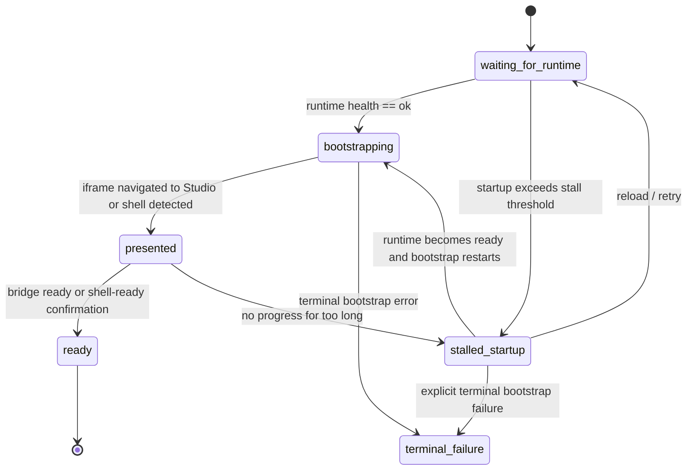

# Studio Startup Contract Plan

Date: 2026-04-19  
Owner: frontend/studio  
Status: proposed

## Why This Exists

Vivd currently has two startup failures that point to the same underlying design gap:

- normal Studio startup can briefly leak a startup stub or bootstrap error document into the iframe, which makes the host show the recovery panel too early
- the host can sometimes keep showing the loading screen even though Studio is already open, and a browser refresh then reveals that the editor had actually loaded

The core problem is that the current flow does not have a clean startup contract between:

- the runtime startup stub
- the bootstrap/auth handoff
- the host iframe lifecycle

The host is compensating with retries, heuristics, and a temporary error-display grace window. That is acceptable as a short-term mitigation, but it is not the clean system.

This plan defines the clean startup contract and the implementation slices needed to get there.

## Problem Summary

Today the host can submit the bootstrap handoff before the Studio runtime is actually ready to accept it. When that happens:

- the startup stub in `packages/studio/entrypoint.sh` can answer inside the iframe with a plain startup document
- the bootstrap handler can still return a generic bootstrap-unavailable error while the runtime is still warming up
- the host then has to guess whether the iframe response is a real failure or just normal startup

At the same time, the host also has the opposite problem:

- the iframe may already have navigated to Studio
- the Studio shell may already be visible or mounted
- but the host still waits for a stronger ready signal and keeps the blocking loading UI on screen

The right fix is not "delay errors a bit longer". The right fix is:

- never treat normal startup as an error path
- reveal Studio as soon as the host has strong evidence that it is already presented
- reserve the recovery panel for real terminal failures only

## Goals

- Prevent normal startup from ever rendering the recovery panel.
- Prevent raw startup or bootstrap error documents from ever being visible to the user.
- Make full blackscreen startup states impossible by ensuring the host always owns the visible surface until Studio is either clearly presented or explicitly failed.
- Reveal Studio as soon as it is actually presented, even if the final ready handshake is late.
- Make the startup path use explicit runtime and bootstrap signals instead of fragile iframe-content heuristics alone.
- Keep a clear recovery path for terminal bootstrap failures and genuine stalls.

## Non-Goals

- Do not redesign the broader Studio preview architecture in this plan.
- Do not change the existing Studio loading skeleton visuals as part of this work.
- Do not remove the current shell-detection and ready-retry protections until the replacement contract is in place.
- Do not collapse startup stalls and terminal failures into one generic user-facing surface.

## Design Principles

1. Normal startup is not an error.
2. Bootstrap should only run when the runtime is ready for it.
3. "Studio is presented" and "Studio is fully ready" are different states.
4. Error UI should be driven by classified terminal failures, not by timing alone.
5. If Studio is visibly there, the host should stop blocking the user even if one ready signal was missed.
6. The user should never see an unclassified empty or black iframe surface.

## Target Contract

### Runtime Readiness Contract

The Studio runtime must expose one explicit answer to:

`Is this runtime ready for bootstrap yet?`

Required states:

- `starting`
  The stub or runtime is alive, but bootstrap must not run yet.
- `ok`
  The runtime is ready to accept bootstrap and open Studio.
- `failed` or equivalent terminal-unavailable state
  Reserved for future explicit runtime failure signaling. This is optional for the first slice, but the contract should leave room for it.

The existing `/health` route is the natural place for this contract. The important rule is that the host must not submit the bootstrap form while the answer is still `starting`.

### Bootstrap Contract

The bootstrap handler must cleanly distinguish retryable startup from terminal bootstrap failures.

Retryable startup responses:

- runtime not ready yet
- startup stub still serving
- temporary bootstrap-unavailable during runtime warmup

Terminal bootstrap responses:

- invalid bootstrap token
- missing bootstrap token
- invalid bootstrap target
- any future explicit non-retryable auth/config failure

Required behavior:

- retryable startup responses must be structured and machine-readable
- terminal failures must stay structured and clearly classified
- the bootstrap path must never rely on plain text startup output as its primary contract

### Host Display Contract

The host should explicitly track:

- `waiting_for_runtime`
- `bootstrapping`
- `presented`
- `ready`
- `stalled_startup`
- `terminal_failure`

User-facing behavior:

- `waiting_for_runtime` / `bootstrapping`: show the normal loading skeleton
- `presented`: reveal Studio even if the final ready handshake is still pending
- `ready`: normal Studio state
- `stalled_startup`: keep the startup visual language and offer recovery actions without using the terminal error panel
- `terminal_failure`: show the recovery panel

Visibility guarantee:

- the host must always render one intentional surface above startup ambiguity: the loading skeleton, a startup-stall treatment, visible Studio, or the terminal recovery panel
- a blank or black iframe must never be the only visible output state during startup or recovery

## Proposed State Machine

## Readiness and Presentation Rules

The host must stop treating "ready" as the only success signal.

### `presented` should be triggered by any of:

- same-origin shell detection via iframe document inspection
- a same-origin Studio route with root/assets clearly mounted
- cross-origin iframe navigation away from `about:blank`
- a bridge event that confirms shell presentation before full readiness

### `ready` should be triggered by:

- `vivd:studio:ready`
- a same-origin shell-ready check that proves the editor has mounted
- any stronger future bridge-level ready acknowledgment

This separation is what prevents the old "Studio was already open but we kept showing loading" regression.

## Failure Taxonomy

### Startup / Transient

These must stay on the startup path and must not surface the recovery panel:

- stub `starting` responses
- bootstrap-unavailable while runtime is still warming up
- about:blank while waiting for runtime readiness
- temporary bootstrap retry while runtime readiness is still converging
- shell presented but final ready handshake still pending

### Stalled Startup

This is not a terminal error.

Definition:

- startup has exceeded a reasonable threshold
- there is still no presentation signal or no further progress
- runtime may or may not be healthy

User treatment:

- keep the startup skeleton or a startup-adjacent stall state
- offer `Reload`
- offer `Hard restart` only when the machine-backed runtime is a plausible culprit
- do not present this state as "session could not be restored" unless a terminal failure has actually been classified

### Terminal Failure

These should surface the recovery panel immediately:

- invalid bootstrap token
- invalid bootstrap target
- missing bootstrap token/target
- repeated bootstrap failure after runtime is already confirmed healthy
- future explicit non-retryable runtime/bootstrap failure states

## Recommended Implementation Plan

### Phase 1: Make Startup and Bootstrap Signals Explicit

Files likely touched:

- `packages/studio/entrypoint.sh`
- `packages/studio/server/http/studioAuth.ts`
- related Studio runtime tests

Changes:

- make startup-stub bootstrap responses structured instead of plain text
- make bootstrap-unavailable during warmup explicitly retryable
- keep invalid token/target failures explicitly terminal
- normalize response payloads so frontend classification does not depend on free-text parsing

Success criteria:

- the frontend can distinguish `starting` from terminal bootstrap failure without fallback heuristics

### Phase 2: Gate Bootstrap on Runtime Readiness

Files likely touched:

- `packages/frontend/src/components/common/StudioBootstrapIframe.tsx`
- `packages/frontend/src/lib/studioRuntimeHealth.ts`
- possibly a new small bootstrap-readiness helper

Changes:

- do not submit the bootstrap form immediately on mount
- poll runtime readiness first
- submit bootstrap only once the runtime reports `ok`
- keep the current same-fingerprint retry protections only as a fallback, not as the primary path

Success criteria:

- normal cold start no longer sends the iframe through the startup stub path during ordinary startup

### Phase 3: Introduce an Explicit Host Startup State Machine

Files likely touched:

- `packages/frontend/src/hooks/useStudioIframeLifecycle.ts`
- `packages/frontend/src/pages/embeddedStudio/EmbeddedStudioLiveSurface.tsx`
- `packages/frontend/src/pages/ProjectFullscreen.tsx`
- `packages/frontend/src/pages/StudioFullscreen.tsx`

Changes:

- replace the current boolean-heavy startup/error handling with explicit startup states
- separate `presented` from `ready`
- keep or improve the existing same-origin shell checks and ready retries
- remove the current temporary error-display grace window once the state machine is in place

Success criteria:

- the user never sees the terminal recovery panel during normal startup
- the host stops blocking the iframe once Studio is clearly presented
- the host never leaves the user on an unowned blackscreen while startup state is still unresolved

### Phase 4: Split Stall UI from Terminal Error UI

Files likely touched:

- `packages/frontend/src/components/common/StudioLoadFailurePanel.tsx`
- existing startup loading components

Changes:

- reserve the current recovery panel for terminal failures
- add a startup-stall treatment that is visually aligned with the loading state rather than with an error card
- keep recovery actions available where useful

Success criteria:

- a long startup does not look like a hard failure
- real failures still provide actionable recovery

### Phase 5: Simplify the Frontend Failure Classifier

Files likely touched:

- `packages/frontend/src/lib/studioIframeFailure.ts`
- `packages/frontend/src/components/common/StudioBootstrapIframe.tsx`

Changes:

- remove or narrow text-based startup heuristics once the runtime/bootstrap contract is structured
- keep only the minimum compatibility parsing needed for older/local startup shapes
- preserve raw-error shielding so JSON/plaintext documents never reach the user

Success criteria:

- the frontend depends on structured startup/failure signals first
- heuristics become a compatibility fallback rather than the main control path

## Validation Plan

### Frontend Regression Coverage

Add or update focused coverage for:

- normal cold start where runtime remains `starting` before becoming `ok`
- runtime becomes `ok`, bootstrap succeeds, iframe becomes `presented` before `ready`
- same-origin presented detection without bridge-ready
- cross-origin navigation away from `about:blank` without immediate bridge-ready
- invalid bootstrap token shows terminal recovery immediately
- stalled startup keeps startup UI and actions instead of terminal error UI

Primary files:

- `packages/frontend/src/hooks/useStudioIframeLifecycle.test.tsx`
- `packages/frontend/src/components/common/StudioBootstrapIframe.test.tsx`
- `packages/frontend/src/pages/EmbeddedStudio.test.tsx`

### Studio Runtime Coverage

Add or update focused coverage for:

- startup stub health and bootstrap-route responses
- bootstrap handler retryable startup response vs terminal failure response
- invalid token/target semantics remain intact

Primary files:

- `packages/studio/server/http/studioAuth.test.ts`
- relevant Studio runtime HTTP tests

### Smoke Validation

After targeted tests are green, run a real startup smoke that covers:

- normal cold start
- reopen after runtime is already warm
- one intentionally delayed ready-handshake scenario

Success condition:

- no startup fallback flash during normal startup
- no raw bootstrap/startup document visible in the iframe
- no false "still loading" state when Studio is already visibly open
- no blackscreen-only startup or recovery state

## Rollout Notes

- Keep the current mitigation only until the explicit startup contract lands.
- Remove the grace-window workaround after the new state machine and readiness-gated bootstrap are in place.
- If needed, ship the new state machine behind a narrow frontend flag for one release, but the target default should remain the clean structured path.

## Open Questions

1. Should bootstrap readiness continue to use `/health`, or should the runtime expose a dedicated `/vivd-studio/api/bootstrap-status` route so auth/bootstrap readiness is more explicit than general runtime health?
2. Should the startup stub special-case the bootstrap route only, or should all non-health startup responses move to a structured startup payload?
3. What is the right product rule for exposing `Hard restart` during `stalled_startup` on non-machine-backed local flows?
